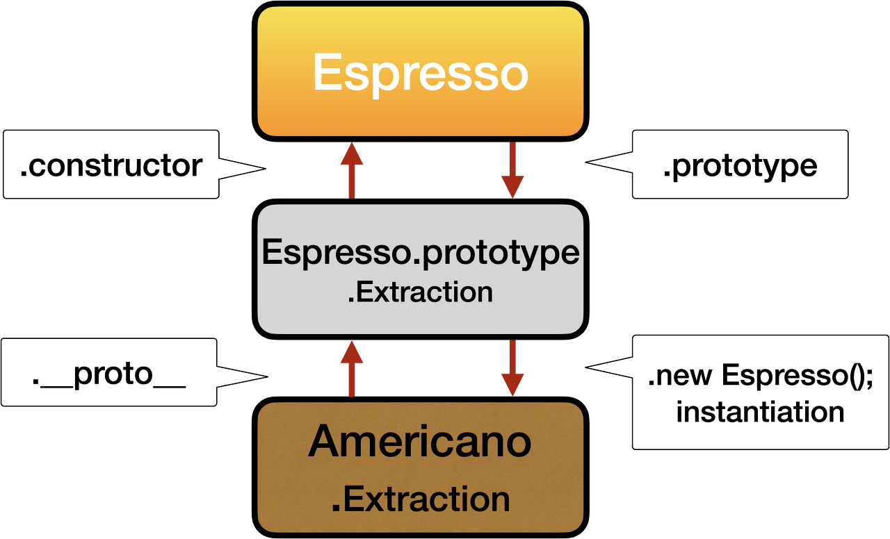

하... OOP 보다 protopytype 이놈을 이해하는데 더 많은 시간기 필요했다.

사실 지금도 완전히 이해 했다기 보다 이렇구나 이정도인것 같다.

OOP를 쓰고 보니 너무 중구난방으로 쓴것같아서

좀더 담백하게 적어볼까 한다.

 

## **개념**

---

**prototype은 뭔가?**

사전적 의미로 원형; 본, 표준, 모범을 뜻한다.

프로그래밍에서는 객체의 원형이라고 할수 있겠다. 앞선 OOP에서 공부했듯이(원래는 prototype의 공부가 먼저 되야 하는걸껄?) 객체는 property를 가질수 있다. prototype은 내가 상속을 해줄때, 상속받야하 하는 property(속성값, 메소드)를 담고 있는 것이다.

상속은 new 라는 것을 통해서 객체를 만들면서 상속받을수가 있다.




## **코드 작성**

---

```
function Espresso(){}
Espresso.prototype.Extraction = true;
 
function Americano(){}
Americano.prototype = new Espresso();
 
var o = new Americano();
console.log(o.Extraction);
// 결과는 true
```

위 작성된 코드와 같이 사용하면 된다.

Espresso의 Extraction을 Americano가 상속을 받았다고 볼수 있다.

이러한 개념들을 OOP에 작성한 글과 연관지어 생각하면 중복해서 적어야 하는 코드들을 많이 줄일수 있을것이다.

 

 

보완할 부분이 더 많은것같다.

이렇게 단순하지 않은데 쉽게 이해하고 설명하려고 하다보니 너무 간추려 진건 아닌지...