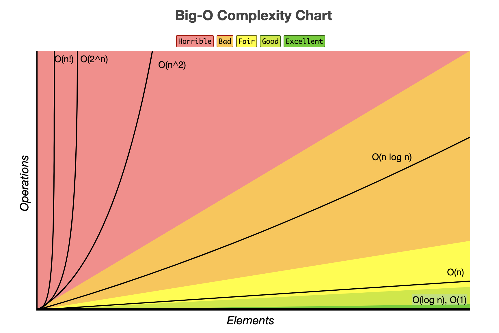
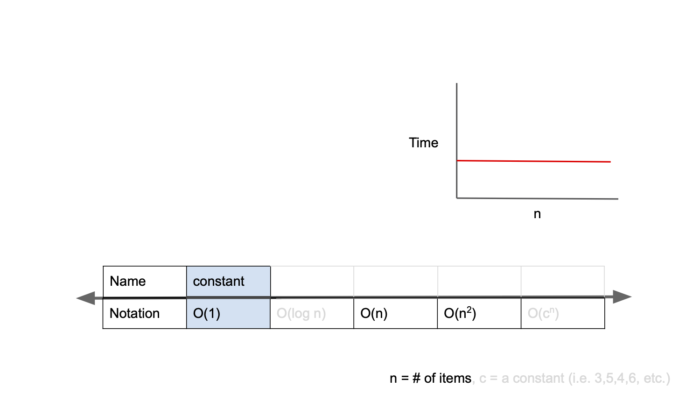
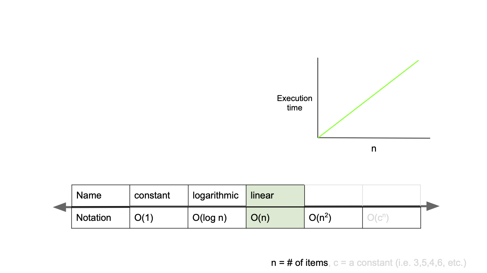
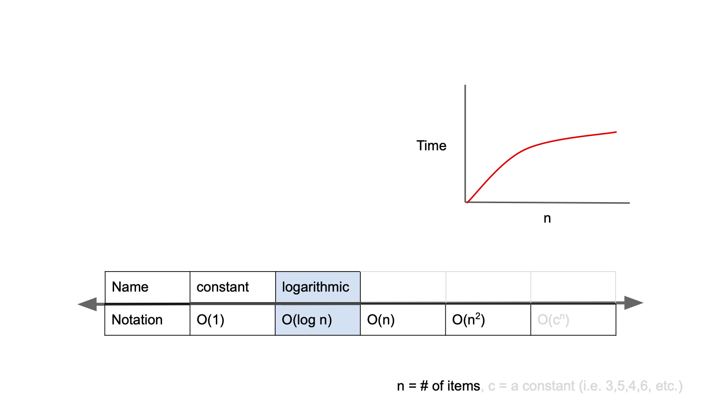
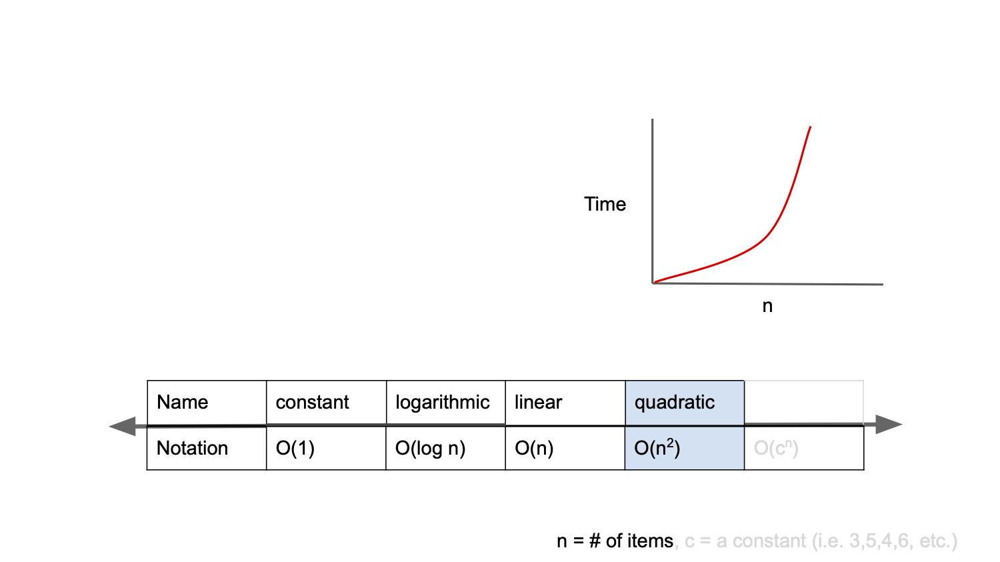
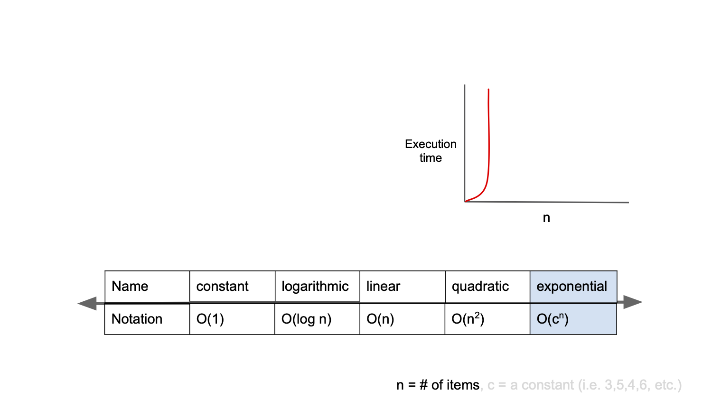

시간복잡도를 정리하려고 하다 보니,

좀더 본질적으로 먼저 알고리즘이 무엇인지 이해해야 했다.

 

 

## 알고리즘(Algorithm)이란?

**알고리즘**은 어떤 문제를 풀어맺기 위해 정해진 일련의 절차나 방법을 공식화한 형태로 표현한 것, 계산을 실행하기 위한 단계적 절차를 의미한다. 즉, 문제풀이에 필요한 계산절차 또는 처리과정의 순서를 뜻한다.

그런데 여기서 우리가 고려해야 하는것은 문제를 푸는 방식이 여러가지라면,

어떻게 풀어야 가장 빠르게 풀수 있는가를 생각해야 한다.

결국 **'문제를 어떤 식으로 푸는 것이 최선인가'**를 고민 해볼 필요가 있다.

그리고 그 최선의 방법을 얻기 위해서 시간복잡도라는 개념이 필요하다.

 

## 시간 복잡도(**Time Complexity)**란?

**시간 복잡도**는 문제를 해결하는데 걸리는 시간과 입력의 함수 관계를 말한다.

컴퓨터과학에서 알고리즘의 시간복잡도는 ***입력을 나타내는 문자열 길이의 함수로서 작동하는 알고리즘을 취해 시간을 정량화하는 것***이다.

좀더 알기 쉽게 표현하자면 아래와 같다.

> 입력값의 증가/감소함에 따라 시간이 얼마만큼 비례하여 증가/감소하는가?

즉, 효율적인 알고리즘을 구현한다는 것은 `입력값이 커짐에 따라 증가하는 시간의 비율을 최소화한 알고리즘`을 구성했다는 이야기이다.

 

## 시간 복잡도의 표기법

시간 복잡도를 표현하는 방법으로는 **Big-O,** Big-Ω, Big-θ가 있다.

이중 주로 **Big-O** 표기법을 사용한다.

**Big-O** 표기법은 최악의 경우 입력값의 증가에 따라 시간 복잡도가 얼마나 증가하는지 표기하는 방법입니다.

최악의 경우 입력값을 고려하는 이유는 최선이나 평균의 입력값보다 더 가혹한 경우를 대비하여 어떤 상황에서도 에러를 발생하지 않게 하기 위함이다.

  

# **Big-O의 종류**

------

### **O(1)**

앞서 Big-O 표기법은 `입력값의 증가/감소함에 따라 시간이 얼마만큼 비례하여 증가/감소하는가`를 표기하는 방법이라 언급했다. O(1)는 constant complexity라고 부르며, 입력값이 증가해도 시간은 늘어나지 않음을 의미한다.

 

### **O(n)**

O(n)은 linear complexity 라고 부르며, 입력값이 증가함에 따라 시간 또한 `같은 비율`로 증가하는 것을 의미한다.

 

### **O(log n)**

O(log n)은 logarithmic complexity라고 부르며 Big-O표기법중 O(1) 다음으로 빠른 시간 복잡도를 가진다. 자료구조에서 배웠던 BST가 대표적인 예이다.

 

### **O(n$^2$)**

O(n2)은 quadratic complexity 라고 부르며, 입력값이 증가함에 따라 시간이 그의 제곱수의 비율로 증가하는 것을 의미한다.

 

### **O(2$^n$)**

O(2n)은 exponential complexity라고 부르며 Big-O표기법 중 가장 느린 시간 복잡도를 가진다.

 

------

 

### 그래서... 어떻게??

결론은 알고리즘을 짤때 시간복잡도가 가장 적합하도록 짜야 한다.

프로그래머스 문제를 풀면서 효율성을 따지게 되는데 그 어떤 조건 보다 시간 복잡도를 줄이는것이 효율성이 가장 잘 올라 갔다.

물론, 프로그래밍에서 절대적인것은 없다.

들어오는 입력값이 엄청 큰 값으로 들어오지 않는다는 조건이 미리 걸려 있다면, 단순히 빠르게 연산되도록 알고리즘을 짜는것이 유리할것이다.

중요한것은 조건을 잘 따져서 시기적절하게 알고리즘을 자는것이다.