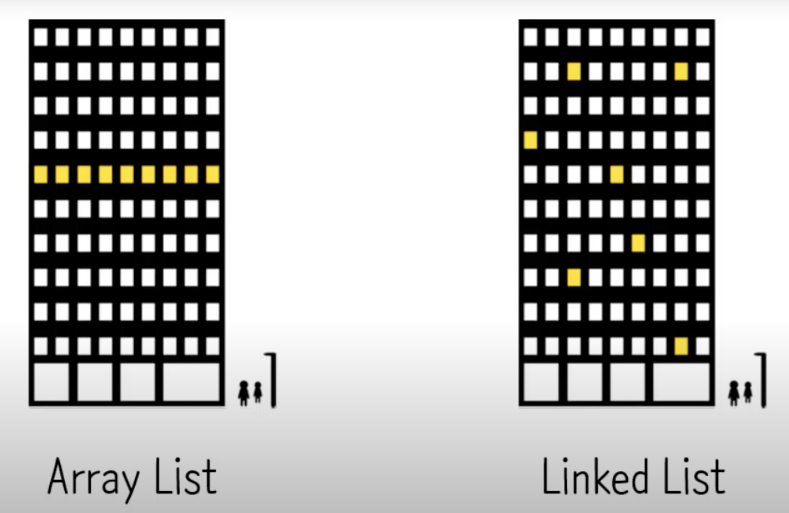

Array List 와 Linked List의 차이에 대해서 알아보자.

# 1. Array List

배열의 특징은 `Index` 이다.

배열에 데이터를 입력할때, 순차적으로 입력되게 되고 입력된 순서에 따라서 Index라는 주소를 부여받게 된다.

이렇게 부여 받은 Index는 원하는 데이터에 바로 접근할수 있게 해준다.

이러한 빠른 접근은 시간복잡도를 O(1)가 된다.

순차적으로 입력된 데이터 사이에 빈공간을 허락하지 않는다.

이런 특징은 데이터를 삽입(수정) 하거나 삭제를 하는 경우에는 O(n)의 복잡도를 갖게 한다.

데이터를 삽입하기 위해서 원하는 주소까지의 접근은 바로 이루어 지지만, 그 공간을 만들기 위해 데이터들을 한칸씩 이동 시키고 난뒤 삽입을 해야한다.

데이터를 삭제할때는 원하는 주소까지 접근하여 삭제한뒤, 빈공간을 메워 주기위해서 뒤에 데이터들을 다 이동 시켜야 한다.

이런 특징 때문에 데이터를 수정하거나 삭제할때는 시간복잡도가 O(n)이 되게 된다.

# 2. Linked List

Linked List는 데이터를 입력할때 위 그림과 같이 주소를 Random하게 저장한다.

배열이 Index를 가지고 있는 반면, Linked List는 데이터 끼리  위치를 연결시켜 위치를 기억하고 있다.

데이터에 접근하기 위해서 연결되어 있는 위치들을 따라서 접근해야 한다. 이로 인해 시간복잡도는 O(n)이 된다.

하지만, 저장된 위치가 랜덤하기 때문에 데이터를 삽입,삭제할때는 그냥 하면된다.

데이터를 찾아가고 난뒤, 해당 데이터를 삽입, 삭제를 하고 나면 뒤에 더 이상 해야할 일이 없다. 그렇기 때문에 데이터를 수정 할 때 시간 복잡도는 O(1)이 된다.

# 결론

- **데이터 접근(Read)을 많이할 경우, → Array List**
- **데이터 수정(Update, Delete)을 많이할 경우 → Linked List**

⇒ 어떤 경우에 사용해야 하는지에 따라 결정해야 한다.