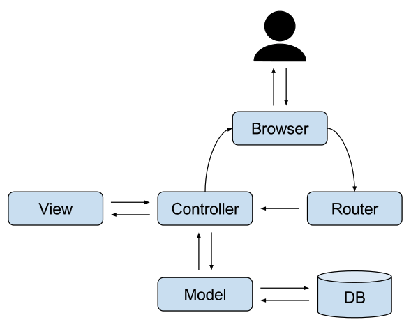

MVC Design Pattern에 대해서 대해서 알아보자.

# MVC 패턴

MVC 는 Model, View, Controller의 약자 입니다. 하나의 애플리케이션, 프로젝트를 구성할 때 그 구성요소를 세가지의 역할로 구분한 패턴이다.

위의 그림처럼 사용자가 controller를 조작하면 controller는 model을 통해서 데이터를 가져오고 그 정보를 바탕으로 시각적인 표현을 담당하는 View를 제어해서 사용자에게 전달하게 된다

MVC패턴은 결국 "어떻게 나눌 것인가"에 대한 해답 중 하나입니다. 어떤 특정한 역할들에 대해 역할분담을 할 때 가이드라인을 제시하는 방법 중 하나가 바로 MVC패턴이다.

그리고 이 패턴을 사용한 라이브러리나 프레임워크로 프로그래밍을 한다면 정말 쉽고 그리고 재밌는 경험을 느낄 수 있으며 아름다운 코드가 탄생하게 된다.
