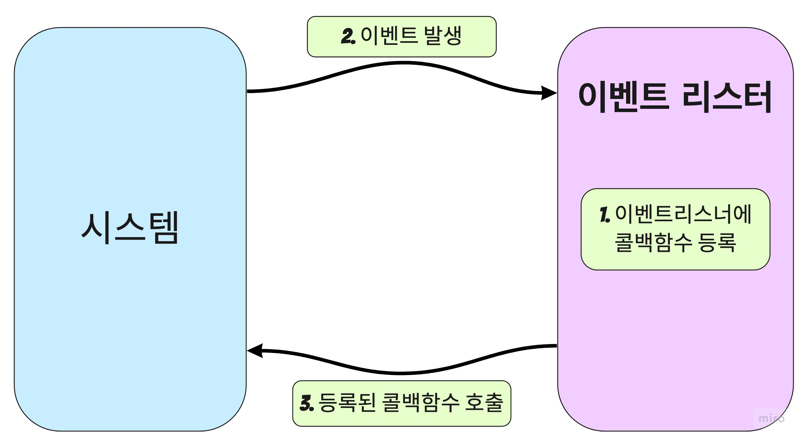

# 1. 이벤트 기반

이벤트 기반이란 이벤트가 발생할 때 미리 지정해둔 작업을 수행하는 방식이다.

대부분의 프로그램들은 이벤트 기반이다.(특정한 동작을 할때 일정한 뭔가가 바뀌는것. 클릭, 스크롤 내림 등)

### 이벤트 리스너란?

⇒ 이벤트를 등록하는 함수

### 콜백함수란?

⇒ 이벤트가 발생했을 때 실행될 함수

 

# 2. 논블로킹 I/O

논블로킹은 오래걸리는 함수를 백그라운드로 보내서 다음 코드가 먼저 실행되게 하고, 나중에 오래 걸리는 함수를 실행한다.

- 논 블로킹 방식 하에서 일부 코드는 백그라운드에서 병렬로 실행된다.

- 일부코드 : I/O 작업(파일 시스템 접근, 네트워크 요청), 압축, 암호화등

- 나머지 코드는 블로킹 방식으로 실행된다.

  ⇒ I/O작업이 많을 때 노드 활용성이 극대화 된다.

동기와 비동기, 블로킹과 논블로킹은 앞에 다뤘기 때문에 이 자체에 대한 설명을 넘어가겠다.

노드는 동기이면서 블로킹, 그리고 비동기 이면서 논블로킹 이 두가지 경우만 존재한다고 생각하면 된다.

<aside> 💡 노드가 비동기 이면서 논블로킹일 경우에 코드가 동시에 돌아간다고 오해를 하게 되는데, 노드에서 동시라는것을 구현하기에는 매우 힘들다. 사실상 일부를 빼면 없다고 생각하는것이 좋다.

</aside>

보통 동기는 코드가 순서대로 실행되고, 비동기는 코드가 순서대로 실행되지 않는다고 생각하고,

동시에 실행되는지 안되는지는 따로 생각해야한다.

 

# 3. 싱글스레드

노드에서는 논블록킹 모델을 채택하여 일부 코드(I/O)를 백그라운드(다른 프로세스)에서 실행 가능

- 요청을 먼저 받고, 완료될 때 응답함
- I/O 관련 코드가 아닌 경우 싱글 스레드, 블로킹 모델과 같아짐.

노드에서는 하나의 주문을 받고 하나의 결과를 내는방식이 아니라 전체 주문을 모두 받고 나서 결과를 한번에 낸다.

결국, 멀티스레드로 하고 싶은데 너무 어렵고 효율적으로 코드를 짜기가 힘들기 때문에 노드를 사용하게 되는것이다.

우리가 중점적으로 생각해야 할것은 `싱글스레드를 어떻게 효율적으로 잘 관리할것인가` 에 중점을 두어야 한다.
