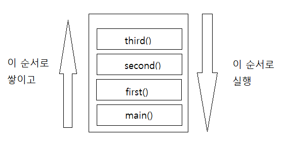
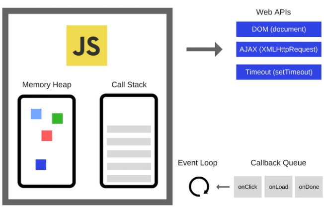

오늘은 정말 이해가 안갔었던 이벤트 루프에 대해서 정리하고자 한다.

흠 이해하기가 쉽지 않은 덩치가 큰 개념인것 같다.

## 내가 잘못 알고 있었던 부분

-   이벤트 루프가 무언가를 저장하는 공간이라고 생각했다.
-   web api의 존재를 알지 못했다.
-   뭐 그냥 몰랐던것 같다.

그럼 이제 이해하러 가보자.

## 컨텍스트

이벤트루프는 콜스텍이 비었을때 큐에서 함수를 보내게 된다. 이때, 컨텍스트에 대한 이해가 없으면 콜스텍을 비게 되는 시점을 잘못 이해할수가 있기에 먼저 컨텍스트에 대해서 알아보자.

1.  컨텍스트
    `상황, 맥락, 문맥 상의 의미` 등으로 이해되는 용어
    -   그냥 텍스트(Text) 처럼 바로 이해되는 단순히 원본 정도가 아니라, 문맥 및 상황에 따라, 어떤 해석이 가미되어 이해되는 한차원 높은공간, 영역을 의미

2.  소프트웨어 관점에서의 컨텍스트
  그때그때 상황에 맞게끔, 실행/판단/결정 등을 해야하는 부분

    > -   할당 연산자(=) 다음에는, 표현식 컨텍스트가 옴
    > -  if 조건문 다음에 { 가 오면, 문장 컨텍스트가 옴
    > -   컨텍스트 메뉴 (context menu)  
    >  → 그 메뉴를 호출한 동작 및 상황에 따라, 다르게 선택 사항들이 나열되는 메뉴

3.  자바스크립트 실행 컨텍스트(Execution Context)

-   실행에 필요한 다양한 정보를 형상화하고, 이들을 목록화 관리하기 위한, 추상적인 개념
    
    -   실행 가능한 코드가 실행되는 `프로그램 환경`
    -   결국, 실행에 필요한 정보들로써 변수 등의 유효 범위(Scope),유효 기간(Lifetime)의 결정을 위한 환경 정보들
    
    > -   변수들 (전역변수, 지역변수, 매개변수, 객체의 프로퍼티)
    > -    함수 선언 정보
    > -   변수의 유효범위(Scope)
    > -   this가 가리키는 것 등
    
    <aside> 💡 자바스크립트 엔진이 실행 가능한 코드를 만나면, 그 코드를 평가해서, 실행 컨텍스트를 만든다.
    </aside>
 
    > 함수를 호출하면,  
    → 현재 실행중인 코드의 작업을 잠시 멈추고,  
    → 실행 컨텍스트 영역을 생성하고,  
    → 이때 생성된 함수 실행 컨텍스트는 실행 컨텍스트 스택에 푸시되고,  
    → 실행 흐름이 그 실행 컨텍스트로 이동하고,  
    → 함수 안팎의 환경을 찾아내어, 실행되어지며,  
    → 함수 실행이 종료되면, 실행 컨텍스트 스택에서 팝되어 제거됨
    

## 호출 스텍

```jsx
function first() {
  second();
  console.log('첫 번째');
}
function second() {
  third();
  console.log('두 번째');
}
function third() {
  console.log('세 번째');
}
first();
third();

```


-   main()은 전역 컨텍스트 이다.
    -   크롬에서는 main 대신 (anonymous)함수로 나온다.
-   처음 first가 호출된다.
    -   first안에 second가 호출된다.
    -   마지막으로 third가 호출된다.
    -   호출된 순서와 반대로 실행 된다.
    -   main()안에 함수가 다 실행되고 나서 main()은 지워진다.
-   first 함수가 끝나고 나서 third가 호출된다.

```jsx
세 번째
두 번째
첫 번째
세 번째

```

## 이벤트루프??

내가 앞에 쓴 글중 async/await 을 설명하면서 자바스크립트는 기본적으로 비동기 논블럭킹 언어이며, 이 생각을 디폴트 값으로 가지고 있어야 한다고 했었다.

*사실 자바스크립트 엔진(V8) 자체는 동기적이다.(힝 속았지?)*

자바스크립트는 싱글쓰레드인데 어떻게 비동기 논블럭킹 가능할까?

그 이유는 web api 와 이벤트 루프를 활용하기 때문이다.



### **Javascript Engine(V8)**

-   V8은 크롬과 Node.js에서 사용되는 구글이 만든 엔진
-   _Memory Heap_ 과 _Call Stack_ 으로 구성
-   자바스크립트 코드를 읽고 해석해서 실행하는 것을 담당
    -   기본적으로 웹 브라우저와 Node.js에 탑재되어 있다.
-   Memory Heap : 코드에서 선언된 변수나 함수 등이 담겨져 있다.
-   Call Stack : 코드가 실행될 때 쌓이는 곳

### web api

-   DOM, Ajax, setTimeout(), Event Handler 등과 같이 웹 브라우저에서 제공하는 기능들이다.
-   Call Stack에서 실행된 비동기 함수는 Web API를 호출하고, Web API는 콜백함수를 Callback Queue에 집어 넣는다.

Javascript Engine의 싱글 스레드 외에 스레드를 지원해 준다. 따라서 자바스크립트에서 비동기를 할 수 있게 해준다.

### **Callback Queue**(Task Queue)

-   web api에서 실행된 함수의 결과값을 보관하는 영역
-   Task Queue는 MicroTaskQueue와 MacroTaskQueue로 나뉨.
-   MicroTaskQueue는 MacroTaskQueue보다 더 우선순위를 가지고 있기 때문에 먼저 Call Stack으로 전달되고 실행되게 된다.

<br>


<br>

### 이벤트루프

-   이벤트 루프는 이 전체 시스템에서 아주 단순한 일을 하는 작은 요소이다.
-   이벤트 루프의 역할은 Call Stack과 Callback Queue를 주시하는 것이다.
-   Stack이 비어있으면, Callback Queue에 첫번째 콜백을 Stack에 쌓아 효과적으로 실행할 수 있게 해준다.

### 함수 실행 Flow

1.  함수 실행  
    ⇒ 실행 컨텍스트가 생성되며 스택에 쌓임
2.  스텍에서 동기함수이냐 비동기 함수이냐 판단
3.  비동기 함수일때 결과값 web api로 바로 전송되어 연산이 진행됨  
	⇒ 스택에서 해당 함수 없어진다.
4.  web api 에서 멀티스레드로 해당 함수들 결과 값들을 큐로 전송
    -   wep api에서는 멀티스레드이기 때문에 빨리 끝나는 함수 부터 큐에 쌓인다.
5.  스택에서는 나머지 함수들 계속 진행
6.  큐에 있는 함수들은 스택에 있는 함수가 다 실행되어 없어질때까지 기다림
    -   이때 스텍에 함수가 남아있는지 안남아 있는지 확인하는 것이 **이벤트 루프**
7.  이벤트 루프를 통해 스택에 함수들이 다 없어지고 나면 마이크로 큐 부터 순차적으로 큐에서 스택으로 전달됨
    -   마이크로 큐 : 일반적인 promise 함수들
    -   매크로 큐 : set으로 시작하는 함수들
        → 자세한 구분은 다르지만 대~~충 이렇게 정의됨.

### 내가 만든 예제

```jsx
const delay = () => {
		let k = 0;
    for (let i = 0; i < 10; i++){
        k++
		console.log(k)
    };
	setTimeout(()=> {
			console.log("delay in setTimeout! 8초!")
		},8000)
    console.log('delay')
}

const baz = () => {
		setTimeout(()=> {
			setTimeout(()=> {
			console.log("baz in setTimeout in setTimeout! 5초!")
			},5000)
			console.log("baz in setTimeout! 8.5초!")
		},8500)
    console.log('baz!');
}

setTimeout(baz, 0);
delay()


```

-   코드 실행 결과

```
1
2
3
4
5
6
7
8
9
10
delay
baz!
delay in setTimeout! 8초!
baz in setTimeout! 8.5초!
baz in setTimeout in setTimeout! 5초!


```

풀이

1.  콜스텍에 setTimeout(bas, 0), delay가 순차적으로 쌓임
    
2.  처음 만난 setTimeout(bas, 0) 은 wep api로 전송 ⇒ 콜스텍에서 setTimeout 사라짐
    
    a.  큐로 간 setTimeout(bas, 0) 은 console.log('baz!')와 setTimeout() 두개를 큐에 쌓아 놓음
3.  delay() 함수 진행
    
    a.  for문 진행 ⇒ `콘솔로그 찍혀 나옴 : 1,2,3,4,5,6,7,8,9,10`  
    b.  setTimeout ⇒ wep api로 전송  
    c.  console.log('delay')⇒ `콘솔로그 찍혀 나옴 : delay`  
    d.  delay가 콜스텍에서 삭제됨  
4.  빈 콜스텍은 이벤트루프가 확인함
    
5.  큐에 쌓여 있던 console.log('baz!')와 setTimeout() 을 콜스택으로 전송
    
    a.  console.log('baz!') ⇒ `콘솔로그 찍혀 나옴 : baz`  
    b.  setTimeout() ⇒ wep api로 전송
6.  현재 wep api 에서는 두개의 함수가 진행되고 있음 : 8초, 8.5초
    
    a.  먼저 끝나는 8초가 큐에 갔다가 비어있는 스택으로 전송됨  
        : `콘솔로그 찍혀 나옴 : delay in setTimeout! 8초!`
        
    b.  뒤어 끝나는 8초.5가 큐에 갔다가 비어있는 스택을 이벤트 루프가 확인함
        
    c.  8.5초 안에는 console.log("baz in setTimeout! 8.5초!") 와 setTimeout이 있음  
        : `콘솔로그 찍혀 나옴 : baz in setTimeout! 8.5초`  
        : setTimeout() ⇒ wep api로 전송
7.  wep api에서 함수진행이 끝난뒤 큐에 갔다가 스택으로 이동되어 옴  
    : `콘솔로그 찍혀 나옴 : baz in setTimeout in setTimeout! 5초!`
    

### 유튜브 강의

아주아주 유명한 강의이다.

솔직히 다른 유튜버들 영상을 찾아 봤는데, 잘못설명하는 부분이 너무 많았다.

영어라서 조금 힘들수 있지만 갓튜브에서 제공하는 자막을 활용해서 정확하게 이해하자.

<iframe width="680" height="382" src="https://www.youtube.com/embed/8aGhZQkoFbQ" title="YouTube video player" frameborder="0" allow="accelerometer; autoplay; clipboard-write; encrypted-media; gyroscope; picture-in-picture" allowfullscreen></iframe>

유튜브에 나온 예제 링크 : [](http://latentflip.com/loupe/?code=CgoKJC5vbignYnV0dG9uJywgJ2NsaWNrJywgZnVuY3Rpb24gb25DbGljaygpIHsKICAgIHNldFRpbWVvdXQoZnVuY3Rpb24gdGltZXIoKSB7CiAgICAgICAgY29uc29sZS5sb2coJ1lvdSBjbGlja2VkIHRoZSBidXR0b24hJyk7ICAgIAogICAgfSwgMjAwMCk7Cn0pOwoKY29uc29sZS5sb2coIkhpISIpOwoKc2V0VGltZW91dChmdW5jdGlvbiB0aW1lb3V0KCkgewogICAgY29uc29sZS5sb2coIkNsaWNrIHRoZSBidXR0b24hIik7Cn0sIDUwMDApOwoKY29uc29sZS5sb2coIldlbGNvbWUgdG8gbG91cGUuIik7)[http://latentflip.com/loupe](http://latentflip.com/loupe)

## 마무리

이해하는데 진짜 힘들었던것 같다.

그래도 이해하고 나서는 적어도 이벤트루프에 대해서는 잘 설명할수 있을것 같다.

_찝찝하게 공부하고 넘어갔던 부분이었는데 명확하게 알게되니 좋군._

어려운만큼 링크가 참고 링크가 많다.

거의 복붙 수준으로 가져온것 같다. 정보를 공유해주신 분들께 감사드립니다.

[참고 링크]

[](https://blog.sessionstack.com/how-does-javascript-actually-work-part-1-b0bacc073cf)[https://blog.sessionstack.com/how-does-javascript-actually-work-part-1-b0bacc073cf](https://blog.sessionstack.com/how-does-javascript-actually-work-part-1-b0bacc073cf)

[](https://www.zerocho.com/category/JavaScript/post/597f34bbb428530018e8e6e2)[https://www.zerocho.com/category/JavaScript/post/597f34bbb428530018e8e6e2](https://www.zerocho.com/category/JavaScript/post/597f34bbb428530018e8e6e2)

[](http://www.ktword.co.kr/test/view/view.php?m_temp1=2668)[http://www.ktword.co.kr/test/view/view.php?m_temp1=2668](http://www.ktword.co.kr/test/view/view.php?m_temp1=2668)

[](https://kingofbackend.tistory.com/120)[https://kingofbackend.tistory.com/120](https://kingofbackend.tistory.com/120)