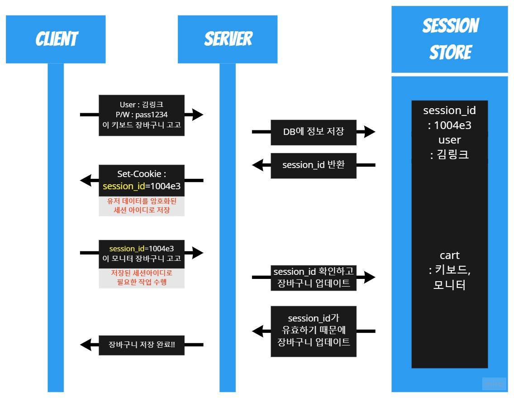
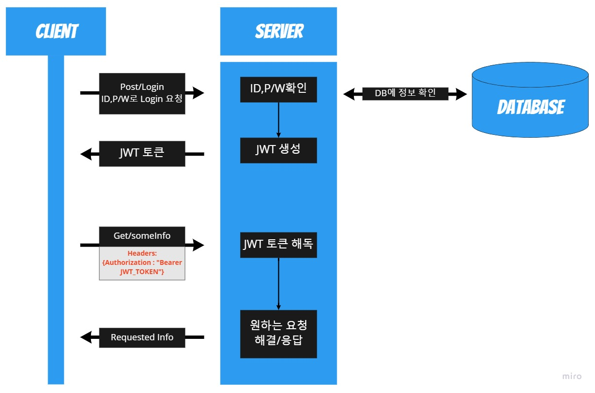
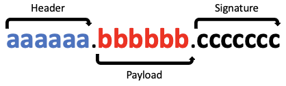

로그인 기능을 구현하게 되면 인증과 인가의 개념이 등장하게 된다.

인증은 유저가 누구인지 확인하는 절차이고, 인가는 유저에 대한 권한을 허락하는 것이다.

이런 인증과 인가를 구현하기 위해 쿠키,세션,토큰(JWT)에 대해 이해하고 있어야 한다.

많은 사람들이 `쿠키 - 세션` 이라고 구분 하기도 하고,`토큰 - 세션` 이라고 구분하기도한다.

어떤것이 맞는것을까?

이 차이는 기준을 어디에 두냐에 따라 달라진다.

저장 위치를 기준으로 구분하는 경우 `쿠키 - 세션`,

인증 위치를 기준으로 구분하는 경우 `토큰 - 세션` 으로 구분할수 있다.

개인적으로는 **`Stateless 서버(토큰 기반), Stateful 서버(세션 기반)`** 로 구분되는것이 정확하다고 생각한다.

그럼 지금부터 쿠키, 세션, 토큰에 대해 좀 더 알아보자.

## 쿠키
쿠키는 서버에서 클라이언트에 데이터를 저장하는 방법의 하나이다.

쉽게 말하자면 쿠키는 `그냥 옮기는 시스템` 혹은 `매개체` 정도의 개념이다.

그렇기 때문에 서버가 원한다면 서버가 클라이언트에 쿠키를 이용하여 데이터를 전송할수도 있고, 클라이언트에서 서버로 데이터를 전송할수도 있다.

<aside> 💡 서버가 클라이언트에 데이터를 저장할 수 있다.

</aside>

서버는 쿠키를 이용하여 데이터를 저장하고 필요할때 저장한 데이터를 다시 불러올수 있다.

하지만 저장한 데이터를 가지고 올때 특정 조건들을 설정할수 있고 그 조건을 만족했을때만 데이터를 가지고 올수있다. 이런 조건들을 쿠키 옵션으로 표현한다.

### Domain

도메인이라는 것은 우리가 흔하게 볼수 있는 `www.google.com`과 같은 서버에 접속할 수 있는 이름이다.

여기서 서브 도메인이란 `www` 같은 도메인 앞에 추가로 작성되는 부분이다.

따라서 요청해야 할 URL이 `http://www.localhost.com:3000/users/login` 이라 하면

여기에서 Domain은 `localhost.com`이 된다.

만약 쿠키 옵션에서 도메인 정보가 존재한다면 클라이언트에서는 쿠키의 도메인 옵션과 서버의 도메인이 일치해야만 쿠키를 전송할 수 있다.

### Path(세부경로)

세부 경로는 `서버가 라우팅할 때 사용하는 경로`이다. 만약 요청해야 하는 URL이 `http://www.localhost.com:3000/users/login` 인 경우라면 여기에서 Path, 세부 경로는`/users/login`이다.

명시하지 않으면 기본으로 `/` 으로 설정되어 있다.

Path 옵션의 특징은 설정된 path를 전부 만족하는 경우 요청하는 Path가 추가로 더 존재하더라도 쿠키를 서버에 전송할 수 있다. 즉 Path가 `/users`로 설정되어 있고, 요청하는 세부 경로가 `/users/login` 인 경우라면 쿠키 전송이 가능하다.

반대로 `/user/login`으로 전송되는 요청은 Path 옵션을 만족하지 못하기 때문에 서버로 쿠키를 전송할 수 없다.

### MaxAge or Expires

`쿠키가 유효한 기간`을 정하는 옵션이다.

MaxAge는 앞으로 몇 초 동안 쿠키가 유효한지 설정하고,

Expires는 언제까지 유효한지 `Date`를 지정한다.

이때 설정하는 시간은 클라이언트 기준이다.

이후 지정된 시간, 날짜를 초과하게 되면 쿠키는 자동으로 파괴된다.

만약, 두 옵션이 모두 지정하지 않으면 브라우저 탭을 닫을때 쿠키가 제거된다.

### Secure

쿠키를 전송해야 할 때 사용하는 프로토콜에 따른 쿠키전송 여부를 결정한다. 만약 해당 옵션이 `true`로 설정된 경우, 'HTTPS' 프로토콜을 이용하여 통신하는 경우에만 쿠키를 전송 할 수 있다.

### HttpOnly

자바스크립트에서 브라우저의 쿠키에 접근 여부를 결정한다. HttpOnly를 `true`로 설정하면, 자바스크립트에서는 쿠키에 접근할수 없다.

설정하지 않을 경우 기본값은 `false`이다. 만약 `false`인 경우 자바스크립트에서 쿠키에 접근이 가능하므로 'XSS' 공격에 취약하다.

### SameSite

Cross-Origin 요청을 받은 경우 요청에서 사용한 메소드와 해당 옵션의 조합으로 서버의 쿠키 전송 여부를 결정하게 된다. 사용 가능한 옵션은 다음과 같다.

-   Lax :Cross-Origin 요청이면 'GET' 메소드에 대해서만 쿠키를 전송할 수 있다.
    
-   Strict : Cross-Origin이 아닌 `same-site` 인 경우에만 쿠키를 전송 할 수 있다.
    
-   None: 항상 쿠키를 보내줄 수 있습니다. 다만 쿠키 옵션 중 `Secure` 옵션이 필요하다.
    
    이때 'same-site'는 요청을 보낸 Origin과 서버의 도메인이 같은 경우를 말한다.
    

이러한 옵션들을 지정한 다음 서버에서 클라이언트로 쿠키를 처음 전송하게 된다면 헤더에 `Set-Cookie`라는 프로퍼티에 쿠키를 담아 쿠키를 전송하게 된다.

이후 클라이언트 혹은 서버에서 쿠키를 전송해야 한다면 클라이언트는 헤더에 `Cookie`라는 프로퍼티에 쿠키를 담아 서버에 쿠키를 전송하게 된다.

쿠키를 다시 정리하자면,

쿠키는 그냥 옮기는 시스템 혹은 매개체 정도의 개념이다.

쿠키 옵션을 만족하는 경우에만 쿠키의 데이터를 가지고 올수 있다.

[참고][MDN - Set-Cookie Attributes](https://developer.mozilla.org/en-US/docs/Web/HTTP/Headers/Set-Cookie)

## 세션 (Session-based Authentication)



위 그림은 로그인을 통해 사용자가 어떤 식으로 웹사이트를 이용하는지 그림으로 나타내었다.

_(순서는 위에서 부터 차례대로 내려 오면 된다.)_

1.  먼저 사용자가 웹사이트에서 아이디 및 비밀번호를 이용해서 로그인을 시도한다.
    
2.  사용자가 정확한 아이디와 비밀번호를 입력했다면, 서버는 인증(Authentication)에 성공했다고 판단하게 된다.
    
3.  다음 번에 인증을 필요로 하는 작업(그림에서와 같이, 장바구니에 물품 추가)을 요청을 하게 되면 서버는 아이디 및 비밀번호의 해시를 이미 알고 있기 때문에 다시 로그인 하지 않아도 된다.
    
    즉, **"인증에 성공했음"을 서버가 알고 있다면, 매번 로그인을 할 필요가 없다.**
    

> 인증에 따라 리소스의 접근 권한(Authorization) 이 달라진다.

이 때 서버와 클라이언트에 각각 필요한 것은,

-   서버는 사용자가 인증에 성공했음을 알고 있어야 한다.
-   클라이언트는 인증 성공을 증명할 수단을 갖고 있어야 한다.

여기서 몇가지 용어가 등장 하게 된다.

-   사용자가 **인증에 성공한 상태**는 `세션`이라고 부른다.
-   서버는 일종의 저장소에 세션을 저장한다. 주로 `in-memory`(자바스크립트 객체를 생각하면 된다), 또는 `세션 스토어`(redis 같은 트랜잭션이 빠른 DB)에 저장한다.
-   세션이 만들어지면, **각 세션을 구분**할 수 있는 `세션 아이디`도 만들어진다
-   보통 클라이언트에 세션 성공을 증명할 수단으로 세션 아이디를 전달한다.

이 때에 `웹사이트에서 로그인을 유지하기 위한 수단으로 쿠키를 사용`한다. 쿠키에는 서버에서 발급한 세션 아이디를 저장하게 된다.

쿠키를 통해 유효한 세션 아이디가 서버에 전달되고, 세션 스토어에 해당 세션이 존재한다면 서버는 해당 요청에 접근 가능하다고 판단한다.

하지만 쿠키에 세션 아이디 정보가 없는 경우, 서버는 해당 요청이 인증되지 않았음을 반환한다.

`즉, 세션이 존재한다면 로그인이 풀리지 않는다.`

> 조금만 더 부가 설명을 하자면, 기본적으로 세션이 만들어 지면 세션의 정보가 sever쪽의 in-memory에 저장된다. 만약 단일 서버로 운영할 경우 큰 문제가 되지 않을 수 있지만, 서비스가 커지는 등의 이유로 많은 서버를 운영할 경우, 서버가 달라질 때 마다 클라이언트에서 가지고 있는 세션 id값은 쓸모 없어 진다. 그렇다 보니 세션id를 여러 서버에서 공용으로 관리할 수 있게 하기 위해 세션을 세션 스토어에 저장하여 사용하게 되었다.

### **로그아웃**

세션 아이디가 담긴 쿠키는 클라이언트에 저장되어 있고, 서버는 세션을 저장하고 있다.

서버는 그저 세션 아이디로만 요청을 판단한다.

> 주의: 쿠키는 세션 아이디, 즉 인증 성공에 대한 증명을 갖고 있으므로, 탈취될 경우 서버는 해당 요청이 인증된 사용자의 요청이라고 판단합니다. 이것이, 우리가 공공 PC에서 로그아웃을 해야 하는 이유입니다.

그러므로 로그아웃을 하기 위해서는,

-   서버의 세션 정보를 삭제
-   클라이언트의 쿠키를 갱신

이 두가지를 진행 해야 한다.

서버가 클라이언트의 쿠키를 임의로 삭제할 수는 없다. 대신, `set-cookie`로 세션 아이디의 키값을 무효한 값으로 갱신해야 한다.

이런 세션을 대신 관리해주는 'express-session' 이라는 모듈도 있다.([express-session](https://github.com/expressjs/session#reqsession))

## 토큰(Token-based Authentication)



위 그림은 토큰기반 인증을 활용하면 사용자가 어떻게 웹사이트를 이용하는지 그림으로 나타내었다.

### 토큰기반 인증 절차

1.  클라이언트가 서버에 아이디/비밀번호를 담아 로그인 요청을 보낸다.
2.  아이디/비밀번호가 일치하는지 확인하고, 클라이언트에게 보낼 암호화된 토큰을 생성한다.
    -   access/refresh 토큰을 모두 생성한다.
        -   토큰에 담길 정보(payload)는 유저를 식별할 정보, 권한이 부여된 카테고리(사진, 연락처, 기타등등)이 될 수 있다.
        -   두 종류의 토큰이 `같은 정보를 담을 필요는 없다`.
3.  토큰을 클라이언트에게 보내주면, 클라이언트는 토큰을 저장한다.
    -   저장하는 위치는 local storage, cookie, react의 state 등 다양하다.
4.  클라이언트가 HTTP 헤더(authorization 헤더)에 토큰을 담아 보낸다.
    -   bearer authentication을 이용한다. 참고 [링크1(요약)](https://learning.postman.com/docs/sending-requests/authorization/#bearer-token), [링크2(상세)](https://tools.ietf.org/html/rfc6750)
5.  서버는 토큰을 해독하여 `"아 우리가 발급해준 토큰이 맞네!"` 라는 판단이 될 경우, 클라이언트의 요청을 처리한 후 응답을 보내준다.

뭔말이지 모르겠나? 조금더 쉽게 말해보자.

1.  클라이언트 부터 아이디와 비번을 받는다.
2.  DB 보니 우리 회원이 맞네. 여기 토큰 있음.  
    a. 토큰은 두개야. 기간 짧은 엑세스 토큰, 기간이 긴 리프레시 토큰  
    b. 엑세스 토큰은 니가 맞는지 인증하는데만 쓸꺼야  
    c.  리프레시 토큰은 엑세스 토큰이 만료 되고 나서 재발급 받을때 쓸거야.  
3.  오 다시 왔네? 엑세스 토큰 내놔봐. 오 우리 회원이 맞구만.
4.  오 다시 왓네? 엑세스 토큰 내놔봐. 엥? 뭐야. 기간 지난거 잖아. 리프레시 토큰 내놔봐.  
    a.  흠 이 엑세스 토큰의 리프레시 토큰이 맞네.  
    b.  자 여기 새 엑세스 토큰 있어, 가져가고 볼일봐.  
5.  또 왔구만. 엑세스 토큰 내놔봐. 뭐야. 기간 지났자나. 리프레시 토큰 내놔바. 이것도 끝났잖아. 다시 로그인 하러가봐~!

이렇게 흘러간다.

`즉, 토큰이 유효하다면 로그인이 풀리지 않는다.`

> **토큰기반 인증은 왜, 그리고 언제 쓸까?**

세션기반 인증은 서버(혹은 DB)에 유저 정보를 담는 인증 방식이다. 서버에서는 유저가 민감하거나 제한된정보를 요청할때마다 `"지금 요청을 보낸 유저에게 우리가 정보를 줘도 괜찮은가?"` 를 확인하기 위해 가지고 있는 세션 값과 일치하는지 확인한다. 매 요청 마다 데이터베이스를 살펴보는 것이 불편하고 비효율적이라 생각될수 있다. 이럴 때 사용할 수 있는 토큰기반 인증이다. 이중 대표적인 `JWT (JSON Web Token)` 에 대해서 알아보자.

### 클라이언트에서 인증 정보 보관하기

클라이언트에서 인증 정보를 보관하는 방법이 `토큰`기반 인증이다.

위 토큰인증 절차 과정을 보면 알겠지만, 서버 쪽에서 사용자에 대한 정보는 저장해 놓지 않고, 클라이언트에서 정보를 토큰에 담에 서버쪽에 제공한다.

물론 회원정보는 DB에 저장되어 있지만, 최초 토큰 발급 시에만 DB에 접근하고, 필요한 정보를 토큰에 담아 클라이언트에 보낸다.

즉, 클라이언트가 가진 토큰안에 유료회원인지 무료회원인지 확인 가능한 토큰을 가지고 다른 유저들과는 다르게 서버에서 제공하는 다양한, 더 프리미엄한 기능을 요청할 수 있다.

세션과의 차이점은 세션스토어를 통해 매번 DB와 접속하며 사용자에 대해 확인해야 하는 방법과 달리,

토큰은 토큰안에 사용자에 대한 정보를 담아 놓고 토큰을 요청과 함께 서버에 보내는 방식이다.

한편, 클라이언트는 XSS, CSRF공격에 노출이 될 위험이 있으니 민감한 정보를 담고 있어서는 안된다는 것을 알고있을 것이다. 그렇다면 `"민감한 정보는 클라이언트에 담으면 안된다면서, 인증에 사용 되는걸 클라이언트에 담는다고?"` 라는 의문이 생긴다.

> 토큰은 유저 정보를 암호화한 상태로 담을 수 있고, 암호화 했기 때문에 클라이언트에 담을 수 있습니다.

### **JWT의 종류**

1.  Access Token
2.  Refresh Token

Access token은 보호된 정보들(유저의 이메일, 연락처, 사진 등)에 접근할 수 있는 권한부여에 사용한다. 클라이언트가 처음 인증을 받게 될 때(로그인시), access token , refresh token 두가지를 다 받지만 실제로 권한을 얻는데 사용하는 토큰은 access token 이다.

> 그럼 access token만 있으면 되는 것 아닌가요?

맞다. **권한을 부여 받는데**엔 access token만 가지고 있으면 된다.

하지만 access token을 만약 다른 유저가 얻게 된다면 어떻게 될까?

access token을을 얻은 다른 유저는 자신이 원래유저인것 마냥 서버에 여러가지 요청을 보낼 수 있게된다(만약 은행의 토큰이 털렸다면??). 그렇기 때문에 access token에는 비교적 `짧은 유효기간` 을 주어 탈취 되더라도 오랫동안 사용할 수 없도록 하는것이 좋다.

Access token의 유효기간이 만료된다면 refresh token을 사용하여 새로운 access token을 발급 받는다. 이때, 유저는 다시 로그인 할 필요가 없다.

> refresh token도 탈취 당한다면요?

유효기간이 긴 refresh token마저 다른 유저가 얻어낸다면 큰 문제가 될 것이다. 상당히 오랜 기간동안 access token이 만료되면 다시 발급 받으며 유저에게 피해를 입힐 수 있다.

그렇기 때문에 유저의 `편의`보다 `정보를 지키는 것이 더 중요`한 웹사이트들은 refresh token을 사용하지 않는 곳이 많다. 세상에 완벽한 보안은 없기 때문에 각 방법들의 장단점을 참고하며 필요에 맞게 사용하는 것이 좋다.

### **JWT 구조**



JWT는 위 그림과 같이 `.` 으로 나누어진 3부분이 존재한다.

1.  **Header**
    
    Header는 이것이 어떤 종류의 토큰인지(지금의 경우엔 JWT), 어떤 알고리즘으로 sign(암호화) 할지가 적혀있다. **JSON** Web Token 이라는 이름에 걸맞게 JSON형태 이다.
    
    ```
    {
      "alg": "HS256",
      "typ": "JWT"
    }
    
    ```
    
    이 JSON 객체를 base64 방식으로 인코딩하면 JWT의 첫번째 부분이 완성된다.
    
2.  **Payload**
    
    Payload에는 정보가 담겨 있다. 어떤 정보에 접근 가능한지에 대한 권한을 담을 수도 있고, 사용자의 유저이름 등 필요한 데이터는 이곳에 담아 암호화 시킨다. 물론 헤더에서 정의한 암호화가 될 정보지만, 민감한 정보는 되도록 담지 않는 것이 좋다.
    
    ```
    {
      "sub": "someInformation",
      "name": "phillip",
      "iat": 151623391
    }
    
    ```
    
    첫번째 부분과 마찬가지로, 위 JSON 객체를 base64로 인코딩하면 JWT의 두번째 블럭이 완성된다.
    
3.  **Signature**
    
    base64로 인코딩 된 첫번째, 그리고 두번째 부분이 완성 되었다면, 원하는 비밀 키(암호화에 추가할 salt)를 사용하여 암호화 한다. base64 인코딩을 한 값은 누구나 쉽게 디코딩할 수 있지만, 서버에서 사용하고 있는 비밀키를 보유한게 아니라면 해독하기 힘들다.
    
    예를들어, 만약 HMAC SHA256 알고리즘(암호화 방법중 하나)을 사용한다면 signature는 아래와 같은 방식으로 생성된다
    
    ```
    HMACSHA256(base64UrlEncode(header) + '.' + base64UrlEncode(payload), secret);
    
    ```
    

### **JWT 사용 예시**

JWT는 `권한 부여`에 굉장히 유용하다. 새로 다운받은 `A`라는 앱이 Gmail과 연동되어 이메일을 읽어와야 한다고 생각해 보자.

유저는,

1.  Gmail 인증서버에 로그인정보(아이디, 비밀번호)를 제공한다
2.  성공적으로 인증시 JWT 를 발급받는다
3.  A앱은 JWT를 사용해 해당 유저의 Gmail 이메일을 읽거나 사용할 수 있다

## 장단점
### 세션

1.  서버는 로그인 된 유저의 모든 정보를 저장한다.
2.  해당 정보를 이용하면 새로운 기능들을 추가할 수 있게 된다.
    -   예를 들면 특정 유저를 쫓아내고 싶을때, 그냥 해당 세션을 삭제해버리면 된다.
    -   혹은 인스타 그램 처럼 로그인된 기기들을 관리하거나 넷플릭스처럼 계정 공유 숫자를 제한할수 있다.
    -   동시접속을 막아야 할때 세션을 사용하게 된다.
3.  서버나 데이터베이스에 부하가 걸리게 된다.

### 토큰(JWT)

1.  Statelessness & Scalability (무상태성 & 확장성)
    -   서버는 클라이언트에 대한 정보를 저장할 필요가 없다
    -   토큰 해독이 되는지만 판단한다.
    -   클라이언트는 새로운 요청을 보낼때마다 토큰을 헤더에 포함시키면 됩니다
        -   서버를 여러개 가지고 있는 서비스일 경우같은 토큰으로 여러 서버에서 인증 가능
2.  어디서나 생성 가능하다
    -   토큰을 확인하는 서버가 토큰을 만들어야 하는 법이 없다(카카오, 구글로그인)
    -   토큰 생성용 서버를 만들거나, 다른 회사에서 토큰관련 작업을 맡기는 것 등 다양한 활용이 가능합니다
3.  권한 부여에 용이하다
    -   토큰의 payload(내용물) 안에 어떤 정보에 접근 가능한지 정할 수 있다
        -   ex) 서비스의 사진과 연락처 사용권한만 부여
4.  강제로그아웃이나 로그인된 기기들을 관리하는것은 할수 없다.
    -   해당 토큰이 만료될때까지는 유효하기 때문이다.
5.  JWT가 사용된 대표적인 사례는 코로나 QR체크인 이다.
    -   정보는 QR에 있고 기계는 확인만 한다.

## 마무리

정리가 잘 되었는지 모르겠다.

처음 얘기로 돌아가서,

저장 위치를 기준으로 구분하는 경우 `쿠키 - 세션` 라고 얘기를 했다.

이는 로그인 되어 있는 동안 사용자의 정보가 토큰을 통해 쿠키에 저장을 했냐, 아니면 세션에대가 저장을 했냐의 관점이고,

인증 위치를 기준으로 구분하는 경우 `토큰 - 세션` 의 경우,

인증,인가를 토큰으로 하냐, 세션으로 하냐의 관점이다.

했던말 또하고 또하고 하는 이유는,

많은 블로그와 정보를 찾아 보았지만,

쿠키, 세션, 토큰을 구분 기준없이 설명된 자료가 많다보니 공부하면 공부할수록 많이 헷갈렸다.

굳이 내가 쓴 글이 아니더라도, 이런 구분 기준만 생각에 넣어 두고 다른 설명글을 읽으면 잘 이해가 될거라고 생각한다.