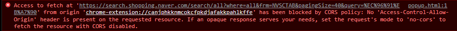

이번에는 CORS에 대해서 얘기해보자.

가끔 프론트에서 요청을 보내면 씨뻘거케해가꼬 에러가 나오게 되는데

뭔가 기분이 나쁘다.

그리고 거기 적힌 내용을 보면 CORS 정책 어쩌고 저쩌고 컨트롤 어로우 오리진 어쩌고 저쩌고 한다.

뭘 잘못했지라는 생각에 이리저리 해보지만 같은 에러가 계속 뜨게 되서 열받는다.

## 언제 에러가 발생 하나요?

이처럼 한 사이트에서 다른 사이트로 요청을 보낼때,

A사이트에서 B 사이트로 정보를 받아오기 위해 ‘http’요청을 보내는 경우

미리 설정을 하지 않으면 CORS문제로 막힌다.

그런데 postman이나 서버에서 요청을 보내면 이런 문제가 없다.

오직 웹사이트에서 ajax요청을 보냈을때 마다 안된다. 이 말은 웹사이트를 여는곳, 즉 크롬이나 엣지, 사파리 같은 브라우저에서 일나는 문제라는 것이다.

이 말은 요청을 막는건 요청을 받는 쪽에서 막는 것이 아니라 보내는 브라우져에서 막는다는 것이다.

## 내가 쓰는 브라우져에서 왜 막죠?

크롬은 사용자가 방문한 사이트를 믿지 못한다.

보통은 사용자가 방문하는 사이트는 사용자가 만든게 아니다.

예를 들면, "젤다.com" 이라는 사이트가 있고 링크라는 사람이 이 사이트를 잘 쓰고 있었다.

보통 어떤 사이트에 접속을 하면 다음에 접속을 했을때 다시 아이디, 비번을 입력할 필요가 없다.(쿠키세션토큰 참고).

즉, 링크가 "젤다.com"에 로그인 해 있고 이 상태가 유지되고 있다는 건 링크가 "젤다.com"에 접속하거나,"젤다.com"에 api요청 등을 보낼때 마다 해당 요청들이 링크가 보낸것임을 증명하기 위해 같이 보내지는 이 인증정보가 크롬에 저장되어 있다.

그런데 "젤다.com"으로 부터 링크의 정보를 빼내기 위해 해커들이 "가논.com" 이라는것을 만들었다.

해커들은 링크한테 링크가 담긴 메일을 보내거나 그럴듯한 게시물로 유인해서 링크가 해커들이 만든 "가논.com"에 접속하도록 유도한다.

링크가 "가논.com"을 접속한다는 것은 해커들이 만든 html, css, js 코드를 링크가 사용한는 브라우져에 받아진다는 의미이다. 그렇게 되면 "가논.com"에서 받아온 자바스크립트 코드로 링크의 브라우져에 있는 정보들을 빼내서 "젤다.com”에서 인증을 받고, 해커들이 "젤다.com"에서 얻은 정보를 "가논.com" 서버로 보내버릴수가 있다.

즉, 링크 의지와 상관없이 링크가 사용하는 브라우져에서 링크의 정보를 가지고 악의적인 행위를 할수가 있게 된다.

이런것을 방지하기 위해서 브라우저는 CORS라는 것을 가지고 어떤 사이트에서 다른사이트를 가지 못하도록 한것이다.

여기서 좀더 정확하게 말하자면, CORS는 막는게 아니라 풀어주는 역활이고, 요청을 막는것은 SOP(동일출처 정책) 이다.

## SOP, CORS 이게 뭔가요?

SOP는 Same-origin policy (동일 출처 정책)의 약자이고,

CORS는 Cross-Origin Resource Sharing (교차 출처 리소스 공유)의 약자이다.

### SOP(동일 출처 정책)

자바스크립트 엔진 표준 스펙의 보안 규칙으로 **하나의 출처(Origin)에서 로드된 자원(문서나 스크립트)**이 **호스트나 프로토콜, 포트번호가 일치하지 않는 자원과 상호작용 하지 못하도록 요청 발생을 제한**하고, **동일 출처(Same Origin)에서만 접근이 가능한 정책**

> 두 URL의 Port(명시한 경우), Protocol, Host가 모두 같아야 Same Origin"scheme/host/port 튜플(tuple)" 혹은 그냥 "tuple"이라고 하기도 한다.

### CORS(교차 출처 리소스 공유)

웹 애플리케이션은 자신의 출처와 동일한 리소스만 불러올 수 있으며, **다른 출처의 리소스를 불러오려면 그 출처에서 올바른 CORS 헤더를 포함한 응답을 반환해야 한다.** 이는 시스템 수준에서 타 도메인 간 자원 호출을 승인하거나 차단하는 것을 결정하는 것이다.

CORS는 웹페이지상에서 자바스크립트를 이용하여 **XHR(XMLHttpRequest)을 다른 도메인으로 발생 시킬 수 있도록 해주는 기능**을 가지고 있고 XHR 기반 **cross-origin HTTP 요청을 이용하여 자원을 공유해야 하는 브라우저와 서버 간의 안전한 교차 출처 요청 및 데이터 전송을 지원**한다.

쉽게 얘기 하자면,

`동일 출처`는 말 그대로 동일한 출처, URL 끼리만 데이터 교환이 일어나도록 하는것이고,

이게 되게 하려면 CORS란 것을 허용해주도록 해야 한다.

`CORS`는 다른 출처간에 리소스를 공유하게 하는것이다.

출처는 보내고 받는 각각의 위치, 즉 웹사이트랑 api 의 주소, 리소스는 주고 받아지는 데이터라고 생각하면 된다.

예를 들면, "젤다.com”에서 네이버 api로 서로 다른 출처 끼리 정보 요청과 반환이 가능하도록 하는게 CORS다.

(엄밀히 말하면 _SOP는 정책이고 CORS는 메커니즘이다.)_

<aside> 💡 사실, 서로 다른 출처끼리 요청을 주고받는건 안되는게 기본값이다.

</aside>

다시 말하면, 서로다른 사이트간에 정보 교환을 위해 합의된 출처들간에 합법적으로 허용해주기 위해 어떤 기준을 충족시키면 리소스 공유가 되도록 만들어진 메커니즘이 CORS이다.

## 그래서 어쩌라구요

조건은 간단하다.

요청을 받는 백엔드 쪽에서 이걸 허락할 다른 출처들을 미리 명시해 두면 된다.

백엔드 서버를 프로그래밍할때 쓰는 프레임워크들(스프링,장고,Express)의 문서를 살펴보면 CORS 옵션을 쉽게 넣는 방법들이 마련되어 있다.

여기다 "젤다.com”등 지정한 사이트를 접근 가능하도록 허용해 두면 지정한 사이트에서는 이 서버로 얼마든지 http 요청을 보낼수 있게 되는것이다.

아무나 쓸수 있도록 하는것은 \*(와일드카드) 이다.

네이버 api에 들어가보면 cors를 허용해 줄 주소들을 지정하는 페이지를 찾을수가 있다.

## 아니 프론트에서 막히는건데 왜 백에서 설정하는거지?

다른 출처 끼리 요청을 보내는것은 cross-origin 이다.

브라우저는 다른출처끼리 요청이 보내질때 요청에 Origin 이라는 header를 추가한다.

header는 데이터가 다른쪽에 보내질때 데이터의 맨 앞쪽에 붙는 보충 정보이다.

header의 Origin 항목에는 요청하는 쪽의 scheme(프로토콜), 도메인, 포트 등이 담겨 있다.

요청을 받게되는 네이버 api는 지정된 Access-Control-Allow-Origin 정보를 header에 실어서 응답하게 된다.

이때 크롬은 header의 정보와 네이버에서 받은 Access-Control-Allow-Origin 정보를 비교해서 똑같이 있으면 안전한 정보라고 인식하고 응답 데이터를 받아 오는것이다.

보내는 쪽에서 개인정보가 담겨 있는 경우 더욱 엄격하다.

요청을 보내는 쪽에서는 credentials 항목을 true로 세팅해야 하고,

받는 쪽 서버에서도 와일드 카드가 아니라 보내는 쪽의 출처-웹페이지 주소를 정확히 명시한 다음 Access-Control-Allow-Credentials 항목을 true로 맞춰 주어야 한다.

이 조건은 simple-request(GET, POST)의 조건이다.

PUT이나 DELETE등 이외 다른 요청들은 본 요청을 보내기 전에 Preflight 요청이라는 것을 먼저 보내서 본 요청이 안전한지 확인 하고 여기서 허락이 떨어져야 본격적으로 요청을 보낼수가 있다.(preflight-request)

서버의 데이터에 영향을 줄수 있는 요청이기 때문에 요청 자체를 보내기 전에 먼저 허용 여부를 검증하는 과정이 필요한 것이다.

정리하자면 cors에서 요청을 두종류

- Simple-Request(GET, POST)

  : 요청을 보내기는 하지만 통과를 못하면 답장을 받아오지 못한다.

- Preflight-Request(PUT,DELETE)

  : 요청을 보내는것도 허락을 받아야 한다.

## 마무리

근데 simple-request도 받는쪽에서 신경을 써놓지 않으면 서버에 저장된 데이터에 변경이 가해질수도 있는것 아닌가?

그렇기 때문에 SOP만 믿을것이 아니라 이런것을 다 대비를 해서 서버를 프로그래밍 해야 한다.

이제 CORS에 대한 개념을 알앗으니,

더 자세한 cors에 대한 설명은 아래 링크에 가면 쑥쑥 이해가 되면서 코드를 잘 칠수 있을 것이다.

[https://ko.javascript.info/fetch-crossorigin#tasks](https://ko.javascript.info/fetch-crossorigin#tasks)

[참고]

[https://velog.io/@jesop/SOP와-CORS](https://velog.io/@jesop/SOP%EC%99%80-CORS)
