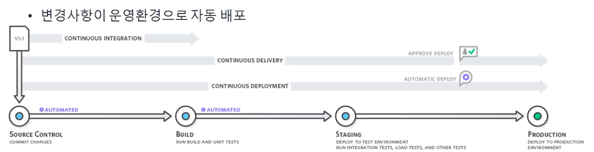
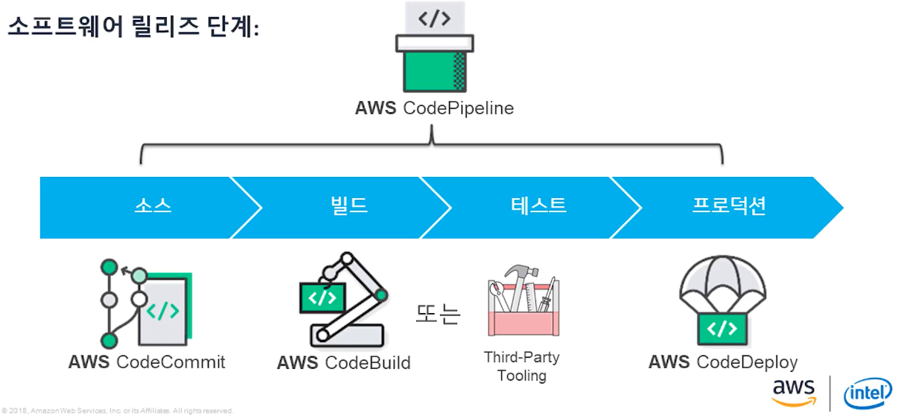
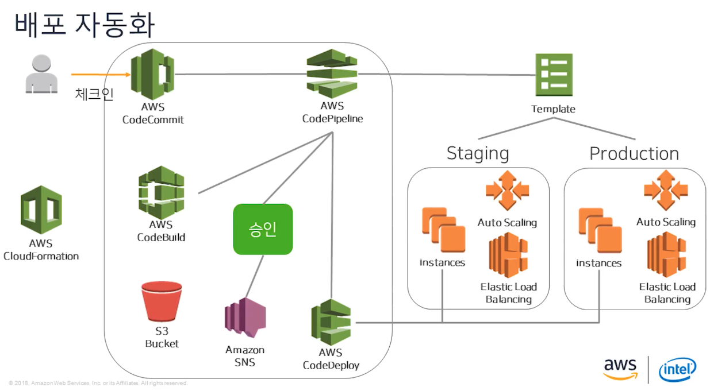
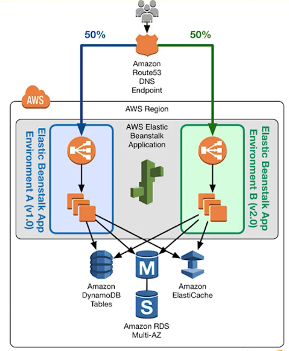

## Intro

---

자동 배포에 대해 이제 공부를 시작하다니 한심하기 그지 없다.

다른 Task 들이 분명 있었지만, 어쩌면 입사 전에 이미 공부를 마쳤었어야 하는 부분이 아닌가 싶다.

이번에 공부하게 된것도 결국 에러를 만나서 찾아보게 되었다.

이전 사수 Martin이 만들어 놓고 간 CICD가 어느 순간 부터 작동 되지 않았다.

다른 업무가 바빠 수동 배포 하고 있었는데 더이상 미룰수 없어서 에러 해결을 결심하게 되었다.

아래 내용들은 유튜브에 나온 내용을 기반으로 개념에 대해서 설명을 나열한 것이다.

자세한 설명은 [유튜브](https://www.youtube.com/watch?v=T5SyIGKZ0x4)를 참고하기 바란다.

 

## CI/CD 란 무엇인가?

---

### CI(continuous Integration) : 지속적 통합

- 모든 개발자가 개발한 코드를 공유 레포지토리에 하루에도 여러번 코드를 커밋하고 병합하는것

### CD(countinuous Delivery) : 지속적 전달

- 개발팀이 짧은 주기로 소프트웨어를 개발하고 언제든지 운영환경으로 안정적으로 배포하는것

### CD(Continuous Deploy) : 지속적 배포

- 변경 사항이 운영환경으로 자동 배포

 

## CICD를 통해 무엇을 할수 있을까?

---

- 빌드, 테스트 및 배포 단계를 자동화
- 소프트웨어 릴리즈 주기 가속화
- 비용 및 배포 변경에 대한 위험 감소
- 개발자가 빠르게 피드백을 얻을수 있음
- 소프트웨어 개발에 대한 반복적인 접근이 쉬워짐

 

## CICD 장점은?

---

- 향상된 협업
- 신속한 전달
- 신뢰성
- 보안
- 확장성
- 속도

 

## CICD의 단계

---

CI/CD의 단계는 **`소스 ⇒ 빌드 ⇒ 테스트 ⇒ 프로덕션`** 으로  총 4 단계로 나눌수 있다.

### 1. 소스 단계

[역할] 

- 버전관리
- 브랜칭
- 코드 리뷰

[도구]

- AWS CodeCommit
    - Git과 호환이 가능한 소스 레포지토리
    - 다른 AWS 서비스와 통합(예 : IAM, KMS)
    - 변경사항 검사
    - Pull 요청과 CloudWatch 알람
- GitHub Enterprise
- Bitbucket, etc.

### 2. 빌드 단계

[역할]

- 컴파일
- 유닛 테스트
- 정적 분석
- 패키징

[도구]

- AWS CodeBuild
    - 소스를 컴파일하고 테스트 한 뒤 배포 준비가 된 asset을 생성하는 관리형 빌드 서비스
    - VPC 액세스
- Jenkins
- Others

### 3. 테스트 단계

[역할]

- 통합 테스트
- 부하 테스트
- 보안 테스트
- 적용 테스트

[도구]

- 여러 기준의 따른 업데이트 검증
    - UI, 로드, 통합, API
- 업데이트 확인 및 버그 발견

### 4. 프로덕션 단계

[역할]

- 배포
- 모니터링
- 검증

[도구]

- AWS CodeDeploy
    - 원하는 리소스에 코드 배포를 자동화 하는 서비스
- 다양한 배포 기법 : Rolling, Blue/Green, Canary

 

## AWS 개발자 도구

---

 

## CI/CD 구조

---

 

## 배포 기법

---

배포 기법에 대해서 조금 더 알아보자.

### Rolling 배포

- 구버전 EC2를 50% 유지하고, 50% 만 신버전으로 업데이트
- 신버전 업데이트가 끝난뒤 나머지 50%도 업데이트 진행

⇒ 인스턴스의 수가 제한적일때 사용

### Blue/Green 배포

- 구버전과 새버전을 동시에 나란히 구성
- 하나의 버전만 프로덕션 트래픽을 처리
- 빠른 롤백 가능
- 운영환경에 영향을 주지 않고 새 버전 테스트 가능
    - 새버전은 다른 포트에서 수신하거나 내부 리소스만 액세스 가능

⇒ 구버전(Blue 환경)의 EC2는 그대로 유지하고, 신버전(Green 환경) EC2를 다른 router로 생성 하여 테스트, 이후 구버전과 신버전의 router를 swap 해줌으로 한번에 업데이트 진행

- 단점으로는 두배의 리소스(EC2)가 필요하다.

### Canary 스타일 배포

- 새 버전의 애플리케이션으로 프로덕션 트래픽의 일부를 분산
- A/B 테스팅 사용 가능
    - 사용자를 A, B 두 그룹으로 나눈뒤 어느 환경이 더 좋은 결과를 내지는 확인하고 둘중 하나를 채택하는 것이 AB 테스팅이다.
- 라우팅은 임의적이거나 사용자 프로필을 기반으로 할 수 있음
- 결과에 따라 Canary 버전이 운영 환경을 대체하거 혹은 중지할수 있음
 
⇒ rout53을 통해 구버전에 90%의 유입을 설정해놓고 신버전에는 10%의 유입만 받는다. 이후 신버전의 반응이 더 좋을 경우 점진적으로 신버전의 유입을 늘려간다.

아래 사진은 Canary 스타일의 이해를 돕기 위한 사진이다.
그림과 같이 비율을 조정하면서 사용자들의 반응 확인이 가능하다.

 

## Outro

---

대략적으로 아주 얕게 정리해 보았다.

올해 상반기 목표로 효율적인 AWS architecture를 구성하는 것이다.

당분간은 CS 기본 개념과 AWS 위주로 공부할것 같다.

intro때 말했던 에러는 TIL로 좀 더 구체적으로 다루도록 하겠다.