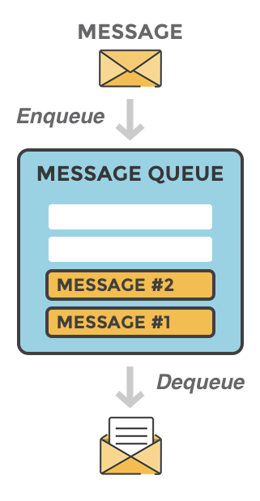
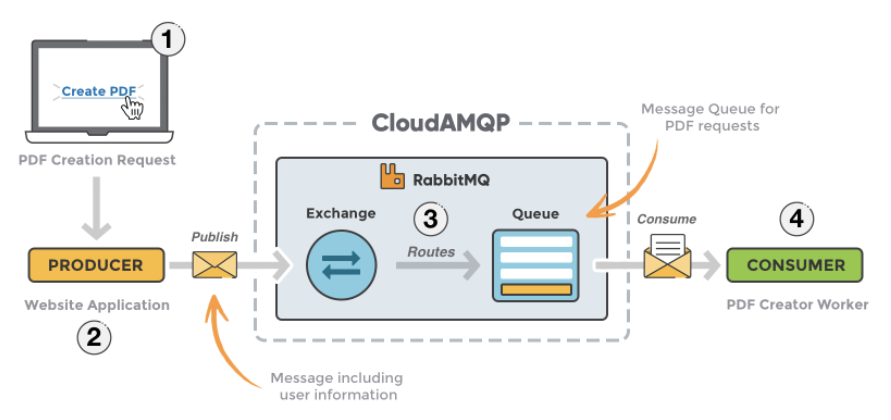
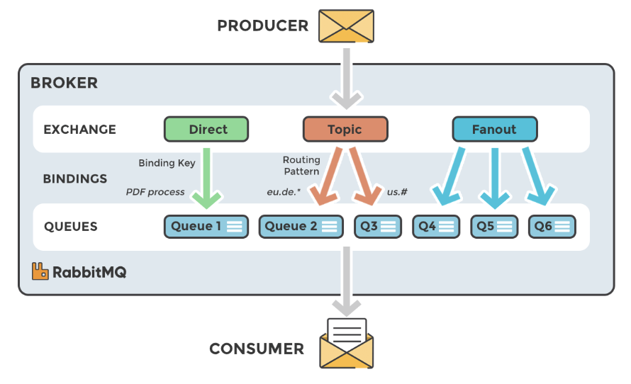
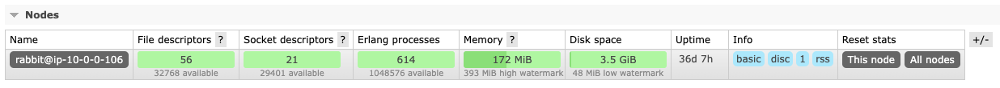

## Intro

---

원활하고 효율적인 크롤링을 위해 큐를 사용하고 있다.

큐라는것을 사실 알고리즘 문제 풀때의 개념중 하나라고만 생각했는데

이것이 하나의 아키텍쳐로 사용하고 있다는것은 회사를 다니면서 알게 되었다.

큐 서버가 여러번 박살이 나면서 어쩔수 없이 공부하게 된 부분에 대해서 끄적여 보려고 한다.

큐의 활용을 어떻게 사용하냐에 따라 매우 다양하다.

여기 기록되는것은 큐 활용의 극히 일부분이다.

 

### **RabbitMQ가 뭔가요?**

---

RabbitMQ 는 AMQP를 따르는 오픈소스 메시지 브로커 제품중 하나다.

 

### AMQP

---

Advanced Message Queuing Protocol(어드밴스트 메시지 큐잉 프로토콜)의 약자로 클라이언트가 메시지 미들웨어 브로커와 통신할 수 있게 해주는 **메세징 프로토콜**이다.

 

### RabbitMQ의 구조

---

RabbitMQ의 구조는 크게 Produser, Broker, Consumer로 나눌수 있고 Broker 안에 Exchage, Routes, Queue로 구성되어 있다.

1. 요청이 들어오게 되면 메시지를 발행하는 **Producer 에서 Broker 의 Exchange 로 메시지를 전달**
2. Routes가 **규칙(Binding)에 의해 연결된 Queue 로 메시지를 복사**
3. Queue에 전달된 메세지를 Consumer가 받아가서 처리
4. Consumer에서 처리가 끝나면 Broker 에게 통지하고, 브로커는 이 알림을 받았을 때만 Queue 에서 메시지를 삭제
    - 메세지를 삭제하지 못하는 경우 Broker에서 Consumer로 메세지가 전달 되면 큐에 있는 메세지를 바로 삭제 하는 경우도 있다.

 

### Exchage의 타입

---

Exchange는 producer에서 전달받은 message를 queue에게 전달해준다.

exchange는 메시지를 어떤 queue에 추가할지? 또, 얼마나 추가할지? 아니면 그냥 버려야할지 이는 exchange 규칙에 의해 정해진다.

exchange 여러 타입들은 Binding에 의해 결정된다.

<aside>
💡 **Binding이란?**

Exchange와 Queue의 관계를 말하며, 뜻 그대로 binding이 되어야 exchange가 queue에게 message를 전달한다.

보통은 사용자가 어느 exchange가 어느 queue를 binding을 할지 정의하지만 앞서 나온 fanout은 기본적으로 모든 queue에 binding에 된다.

</aside>

 

 

1. Fanout
 : Fanout 타입은 exchange와 **binding**된 모든 queue에게 동일한 message를 보낸다.
2. Direct
 : Direct 타입은 exchange와 message를 보낼 queue를 routing key를 통해 직접 선택하여 binding 할 수 있다.
3. Topic
 : 특정 Routing Pattern이 일치하는 Queue로 Routing
    
    <aside>
    💡 direct 타입과 같이 publish 할 때 설정되는 routing key는 binding 할 때 설정되는 routing key와 완벽히 일치해야 binding 된다.
    
    direct 타입과 별반 다를게 없어 보이지만 topic 타입은 routing key 문자열 내 *(start), #(hash)를 삽입시켜 유연한 binding을 제공한다.
    
    </aside>
    
4. Headers
 : key-value로 정의된 Header 속성을 통한 Routing
    
    <aside>
    💡 Headers 타입은 producer 측에서 정의된 header의 key-value 쌍과 consumer 측에서 정의된 argument의 key-value 쌍과 일치하면 binding 된다.
    
    producer 측에서 정의하는 header는 message와 함께 publish 하며 consumer 측에서는 exchange와 queue를 binding 하는 시점에 argument를 정의 한다. (header 타입으로 routing key를 설정해도 무시된다.)
    
    </aside>
    

 

### Queue

---

Exchange는 producer로 부터 전달 받은 message를 bingding되는 queue들에게 동일하게 전달하고

queue는 전달 받은 message들을 연결된 consumer들에게 공평하게 Round-Robin 스케쥴링 방식으로 나누어 준다. (병렬 처리)

 

### 더하기

---

앞서 인트로에서 큐 서버가 여러번 박살났다고 했었다.

왜 박살이 났냐?

바로 메모리 때문이었다.

RabbitMQ는 관리창을 지원해주는데 여기에 보면 메모리 부분이 있다.

여기 이 메모리가 100%가 넘어 버리면 브로커는 멈춰 버리고 메세지를 받지도, 주지도 못하는 상황이 된다.

메모리를 결정하는 것은 EC2(가상 컴퓨터) 성능의 60% 를 사용한다.

즉 과도한 consumer connetion은 많은 메모리를 잡아 먹게 되니 활용에 따라 적절하게 메모리를 적용하고, 부득이한 경우 EC2의 메모리 용량을 증대 시킴으로 큐 서버가 멈추는 현상을 막을수 있다.

[참고]

[Messaging that just works - RabbitMQ](https://www.rabbitmq.com/)

[RabbitMQ에 대해](https://nesoy.github.io/articles/2019-02/RabbitMQ)

[RabbitMQ 개념](https://hwannny.tistory.com/82#recentEntries)

[RabbitMQ 동작 이해하기 :: 조은우 개발 블로그](https://jonnung.dev/rabbitmq/2019/02/06/about-amqp-implementtation-of-rabbitmq/)