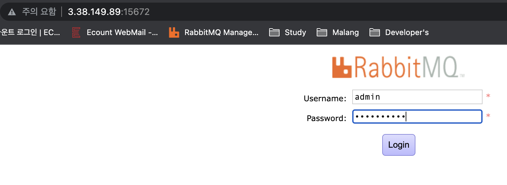
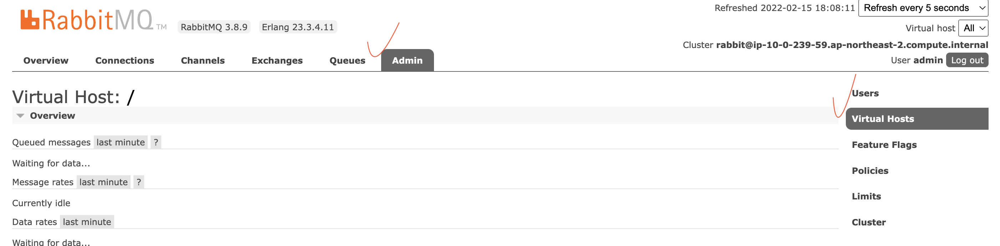
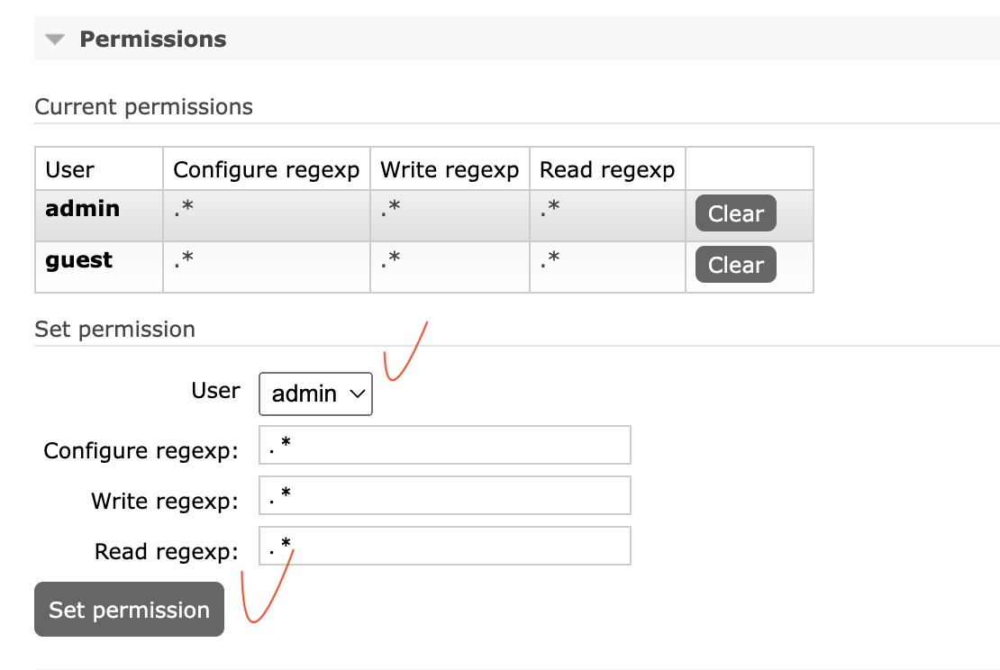

## Intro

---

큐에 대한 설명은 지난번에 했으니 실제로 가상인스턴스에서 어떻게 환경을 구축하는지 알아보자.

 

## Setting

---

RabbitMQ를 설정할때 중요한것은 버전이다.

먼저 erlang을 설치하고 그다음 rabbitMQ를 설치해야 한다.

이때 erlang의 버전에 따라 지원하는 rabbitMQ의 버전도 달라저야 한다.

그리고 아래 세팅은 ec2 인스턴스 시작 기본세팅(node, npm, git 설치) 이후 진행하도록 하자.

 

### RabbitMQ 설치 및 세팅

- erlang 설치(23.3.4)
    
    ⇒ erlang 버전에 따라 설치 가능한 RabbitMQ버전이 다르다. 
    
    `curl -s https://packagecloud.io/install/repositories/rabbitmq/erlang/script.rpm.sh | sudo bash`
    
- **RabbitMQ 설치**
    
    `wget https://github.com/rabbitmq/rabbitmq-server/releases/download/v3.8.9/rabbitmq-server-3.8.9-1.el7.noarch.rpm`
    
    > RabbitMQ signingkey를 import하고, wget을 통해 다운 받은 rabbitmq rpm을 설치
    > 
    
    `sudo rpm --import https://www.rabbitmq.com/rabbitmq-signing-key-public.asc`
    
    `sudo yum install -y rabbitmq-server-3.8.9-1.el7.noarch.rpm`
    
- ****Management Plugin 활성화****
    
    `sudo rabbitmq-plugins enable rabbitmq_management`
    
- **RabbitMQ restart**
    
    `sudo service rabbitmq-server restart`
    
- 관리자 계정 추가
    - 터미널에서 아래와 같이 입력한다.
    
    `sudo rabbitmqctl add_user rabbitmq password`
    
    `sudo rabbitmqctl set_user_tags rabbitmq administrator`
    
    ⇒ 실제 사용 예시 : ID가 admin이고 PW가 test1234일 경우
    
    `sudo rabbitmqctl add_user admin test1234`

    `sudo rabbitmqctl set_user_tags admin administrator`
    
- ****Management Plugin 접속****

    rabbitMQ는 자체적인 management UI를 제공한다. 
    
    ip 주소 뒤에 포트번호로 15672을 붙여주면 접근이 가능하다.
    
    `“ip” + :15672`
    
    
    
- 계정 권한 부여
    
    **admin → Virtual Hosts → 표안에 있는 “/” 클릭**
    
    
    
    **user → admin 확인 → set permission**
    
    

 

[참고]

- erlang 설치(23.3.4)
    
    [https://packagecloud.io/rabbitmq/erlang/install](https://packagecloud.io/rabbitmq/erlang/install)
    
- 설치 및 시작
    
    [https://kabby91.tistory.com/49](https://kabby91.tistory.com/49)
    
- 버전 지원 참고
    
    [https://www.rabbitmq.com/which-erlang.html](https://www.rabbitmq.com/which-erlang.html)
    
- 명령어 참고
    
    [https://zetawiki.com/wiki/RabbitMQ_시작,_정지,_재시작,_리로드](https://zetawiki.com/wiki/RabbitMQ_%EC%8B%9C%EC%9E%91,_%EC%A0%95%EC%A7%80,_%EC%9E%AC%EC%8B%9C%EC%9E%91,_%EB%A6%AC%EB%A1%9C%EB%93%9C)

 

## Outro

---

쓰고 보니 별거 없지만...

그 당시에는 기존 세팅된 버전과 동일한 버전으로 맞추기 위해 정말 개고생 했던것 같다.

몇번이고 지웠다 다시깔았다 삽질을 계속하면서 찾고 또 찾고 너무 힘들었던거 같다.

AWS에 SQS라는 기가막힌게 있던데...ㅎㅎ