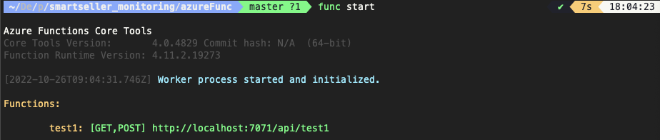

## Intro

---

Azure 까지 쓰게 될줄 몰랐다.

AWS에 너무 익숙해 버려져서 처음에 많이 어려웠지만,

에러 대응이 시급했기 때문에... 하긴 했다.

Azure에 대해서 깊게 공부 하진 못했고,

단지 Azure Function을 띄우고 구동하는데 까지의 과정을 적어보겠다.

<br>

## Azure Function 시작하기

---
> 본 내용을 실행하기전 터미널상 azure cli를 통해 로그인이 되어 있어야 한다.
>

1. 새 폴더 생성후 터미널로 폴더 접속
2. **종속성 설치**
    
    - 명령어 : **`npm install -g azure-functions-core-tools@4 --unsafe-perm true`**

3. **Azure Functions 프로젝트 만들기**
    
    - 명령어 : **`func init`**
    
    
    
4. **함수 만들기**
    
    - 명령어 : **`func new`**
    
    
    
5. **로컬에서 함수 프로젝트 실행**
    
    - 명령어 : **`func start`**
    
    
    
    여기에 나오는 주소는 테스트용 주소 이고 실제 주소는 애저 콘솔에서 확인 가능함
    
    
    
    
    
6. **Azure에 코드 배포**
    
    - 명령어 : **`func azure functionapp publish <sellhaGetProduct>`**
    

7. http 트리거 세팅

    여기 까지 진행 되면 새폴더 안에 함수이름의 폴더와 몇가지 파일들이 생성된것을 확인할수 있다.

    함수 폴더 안에 index.js를 수정하면 함수 코드를 변경할수 있고, function.json을 수정하면 트리거 및 옵션을 수정할수 있다.
    
    [참고링크 바로가기](https://learn.microsoft.com/en-us/azure/azure-functions/functions-bindings-http-webhook-trigger?tabs=in-process%2Cfunctionsv2&pivots=programming-language-javascript)
    
    - function.json 코드 수정
        
        ```jsx
        {
          "bindings": [
            {
              "authLevel": "function",
              "type": "httpTrigger",
              "direction": "in",
              "name": "req",
              "methods": [
                "get",
                "post"
              ],
              "route": "product/{keyword}/{index:int?}"
            },
            {
              "type": "http",
              "direction": "out",
              "name": "res"
            }
          ]
        }
        ```
        
        `{category:alpha}` 로 하게 되면 해당 위치에 알파벳만 쓸수 있다.
        
        주소가 조금이라도 틀리면 404 에러가 뜬다.
        
        
        
    - index.js 코드 수정
        
        ```jsx
        module.exports = async function (context, req) {
        
            const keyword = context.bindingData.keyword;
            const index = context.bindingData.index;
            const message = `keyword: ${keyword}, Index: ${index}`;
        
            context.res = {
                body: message
            }
        }
        ```
        
        - axios를 require 해 올때는 다음과 같이 표기 해야 한다.
        
        ```jsx
        const axios = require("axios");
        const cheerioModule = require("cheerio");
        
        module.exports = async function (context, req) {
        
            const keyword = context.bindingData.keyword;
            const index = context.bindingData.index;
            const message = `keyword: ${keyword}, Index: ${index}`;
            const pageSize = 80;
        
            const url = `https://search.shopping.naver.com/search/all?sort=rel&pagingIndex=${index}&pagingSize=${pageSize}&viewType=list&productSet=total&deliveryFee=&deliveryTypeValue=&frm=NVSHATC&query=${encodeURI(keyword)}&origQuery=${encodeURI(keyword)}&iq=&eq=&xq=`;
            const config = {
                headers: {
                  "User-Agent":
                    "Mozilla/5.0 (Macintosh; Intel Mac OS X 10_15_7) AppleWebKit/537.36 (KHTML, like Gecko) Chrome/105.0.0.0 Safari/537.36",
                },
            };
            const response = await axios.get(url, config);
            const $ = cheerioModule.load(response.data);
            const $json = $("script#__NEXT_DATA__");
            const jsonData = JSON.parse($json["0"].children[0].data);
            // console.log(response);
            console.log($json);
        
            context.res = {
                body: {jsonData,message}
            }
        }
        ```
        
        - 아래와 같이 오류가 난다면 라이브러리를 가져 오는 방법이 잘 되었는지 확인해야 한다.
            - `const {default: axios} = require("axios");` 로 표시기 발생하는 오류
            - `const axios = require("axios");` 로 표기할것
        
        
        
        - 아래와 같이 오류가 난다면 context.res 의 body에 들어가는 데이터가 json 형태가 아닌 경우에 발생할수 있다. 그러니 json 형태로 변환하여 body값에 입력할수 있도록 하자.
        
        
        
        - 배포시 package.json의 dependencies가 제대로 되었는지 확인 해야 한다.
            
            `npm i cheerio`를 제대로 하였지만 반영이 안된 경우가 있어 한참을 헤매었다.
            
        
        ```json
        {
          "name": "",
          "version": "1.0.0",
          "description": "",
          "scripts": {
            "start": "func start",
            "test": "echo \"No tests yet...\""
          },
          "dependencies": {
            "axios": "^1.1.3",
            "cheerio": "^1.0.0-rc.12"
          },
          "devDependencies": {
            "azure-functions-core-tools": "^4.x"
          }
        }
        ```
        
        - 환경설정이 깔끔하게 해결되어야 배포 후에 에러가 발생하지 않는다.


    - 함수 URL 가져오기
        
        함수 가져오기가 제대로 되었다면 아래와 같이 복사가 된다. {keyword}가 뜨지 않으면 이전 배포의 url이므로 새로고침을 통해 함수 url을 제대로 가져 와야 한다.
        
        `https://sellhagetproduct.azurewebsites.net/api/product/{keyword}/{index:int?}?code=m5aeFa7L4hyhcLuUJ9yow==&clientId=default`