## Intro

---

평생(이라고 해봣자 1년 6개월..) javascript 위주로 공부하고 python을 깔짝 대면서 코딩을 해왔는데,

이직을 했고,

여기는 Django가 메인이고, python을 깊게 공부 해야 했다.

Django를 공부하면서 지금 삽질을 엄청나게 하고 있다가 동료분께서 튜플과 `parser_classes` 에 대해서 공부해 보라고 귀뜸해 주셨다. `parser_classes` 는 다음에 적기로 하고 튜플먼저 알아 보도록 하자.

 

## Python 자료형

---

튜플(Tuple)은 python 자료형 중 하나다.

그래서 python의 자료형을 한번 구경해 보자.

python의 자료형을 크게 숫자(numbers), 시퀀스(sequence), 매핑(mapping) 으로 나누고 있다.

 

### 0. 자료형 확인

`type()`함수를 사용해서 어떤 자료형인이 확인이 가능하다.

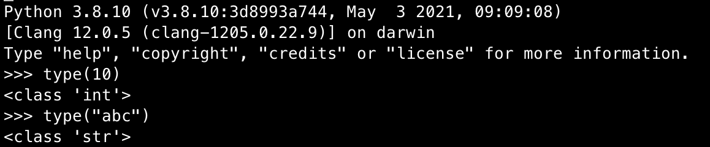

 

### 1. 숫자(numbers)

- 정수(`int`)
    
    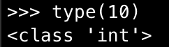
    
- 부동소수점수(`float`)
    
    : 소숫점에 대해선 메모리 구조와 계산에 있어서 조금 더 조심해야 한다만, float로 
    
    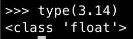
    
- 복소수(`complex`)
    
    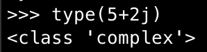

 

### 2. 시퀀스(sequence)

시퀀스는 for문에서 사용 할 수 있는 것

- 문자열(`str`)
    
    : 문자열도 각 문자들의 나열로 인식할수 있기때문에 시퀀스에 분류가 된다. 자바스크립트와 차이점은 없다.
    
- 리스트(`list`)
    
    : 자바스크립트에서 배열(array)과 같다.
    
    대괄호([ ])안에 `,` 로 `자료형` 들을 넣어 나열할수 있다.
    
    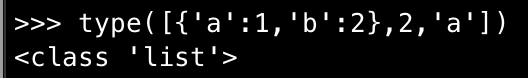
    
- 튜플(`tuple`)
    
    : list와 유사하다. 
    
    tuple 할당은 소괄호를 사용한다.
    
    - 이때 주의할 점은 1개의 자료만 넣을때 반드시 뒤에 `,` 를 붙여 줘야 한다.
    
    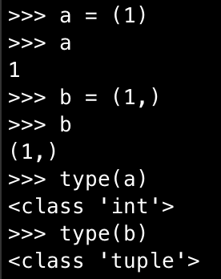
    
    위 사진을 보면 `,`를 쓰지 않았을때는 tuple로 할당되지 않는다.
    
    - tuple의 가장 중요한 특징은 데이터의 수정이 불가능 하다.
    
    아래 예시 사진을 보자.
    
    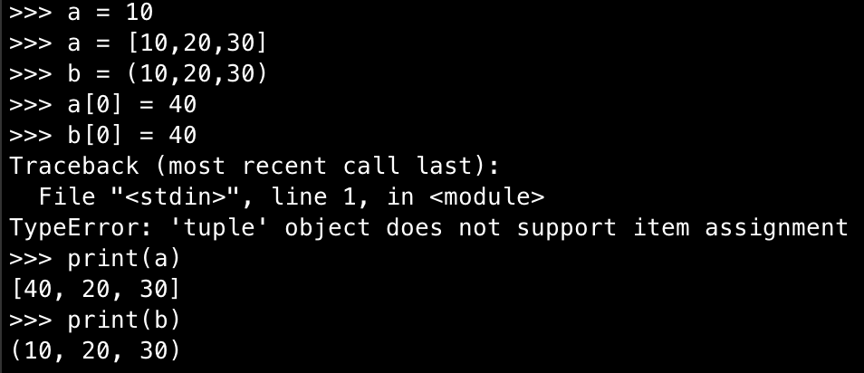
    
    위 사진을 설명하자면,
    
    a는 list, b는 tuple을 할당 하였다.
    
    a의 0번째 index를 수정하면 수정이 쉽게 일어 나지만,
    
    b의 0번째 index를 수정하려고 하면 에러가 발생한다.
    
    - tuple을 수정하고 싶을때는 재할당 하거나, tuple을 list로 변경해서 수정한뒤 다시 tuple로 변환 시켜준다.
    
    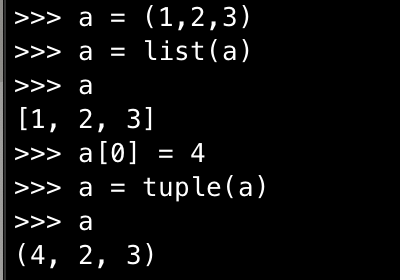
    
    - list와 tuple간 변환이 간단하다.
    - 이런 방법이 싫다면, 새로운 변수를 선언하고 오려붙이기 처럼 할당하는 방법도 있다.

 

### 3. 매핑(mapping)

- 딕셔너리(`dict`)
    - 딕셔너리는 javascript의 객체와 유사하다.
    
    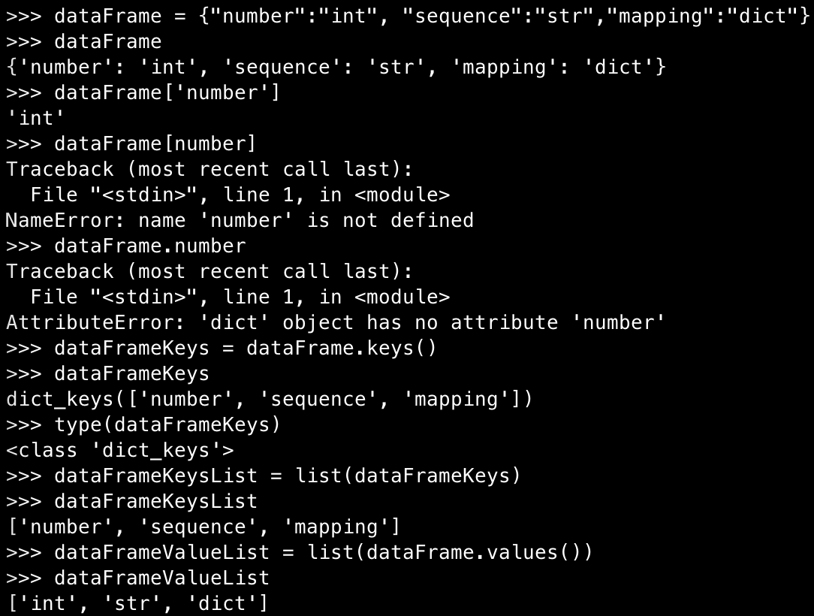
    
    - key와 value의 쌍으로 이루어 진다.
    - value값을 key값으로 보기 위해서는 `dict명[’key명’]` 으로 확인 해야한다.(javascript와 다름)
    - `.keys()` , `.values()` 를 통해 `dict` 의 key와 value값만 모아서 볼수  있다.
        - 이때 해당 함수만 사용하면 class로 저장 된다.
        - 이렇게 구해진 class는 `list()` 함수를 통해 list로 변환이 가능하다.
    
    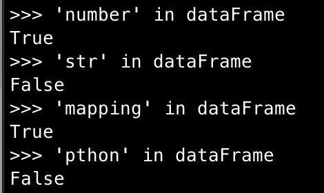
    
    - `in` 을 통해 `dict` 에 있는 key값의 유무를 알수 있다.

 

### 4. 불(bool)

- 불(`bool`) : 참,거짓을 표현

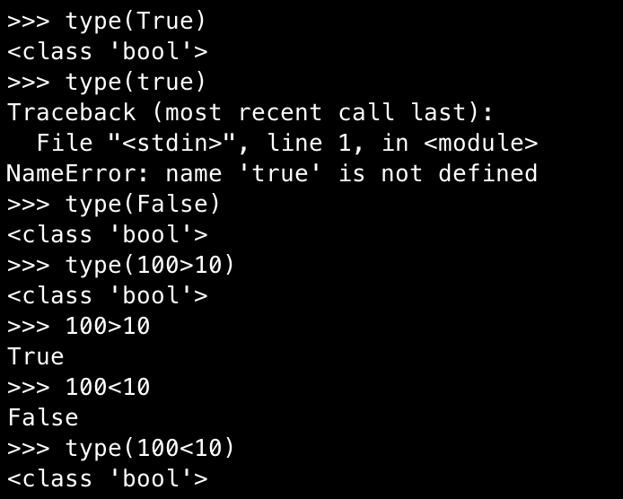

- javascrtipt 에서는 첫글자가 소문자로 boolean이라 하지만, python에서는 첫글자가 대문자로 bool이라 한다.

 

### 5. 세트

- 세트(`set`): 집합을 표현한다.

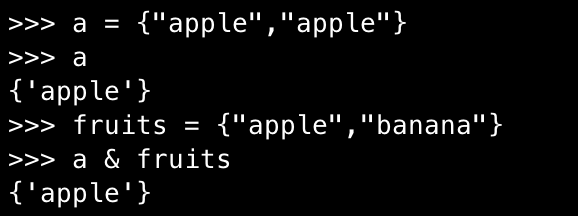

- 중괄호를 사용한다.
- 중복된 데이터를 가지지 않는다.
- 집합 연산을 사용할수 있다.
    - 교집합 : `&`
    - 합집합 : `|`
    - 차집합 :  `-` (앞에있는 세트에서 뒤에 있는 세트를 뺀다)

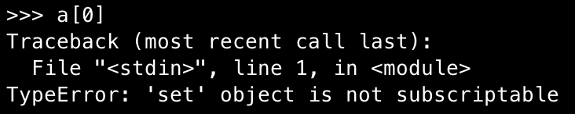

- 데이터를 인덱싱해서 가지고 있지는 않는다.

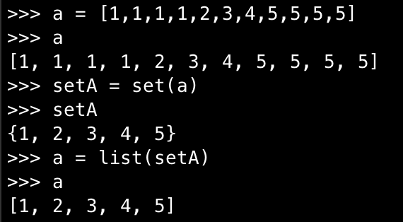

- `list` 와 `set` 형태로 변환이 간단하다.
    - 중복거에 용이할듯 하다.

 

## outro

---

javascript 자료형에 너무 익숙해 져 있어서 튜플이 자료형이라는 생각도 못했었던것 같다.

완전 우물안 개구리가 따로 없다.

앞으로 다른 언어를 공부하게 된다면 자료형 부터 공부해 봐야 겠다.

기초라 금방 끝날줄 알았는데, 생각했던것 보다 몰랐던 python의 기능이 많았고 오래 걸렸다.

내가 알고 있던 python지식은 없는것과 마찬가지였던것 같다.

항상 뭔가 공부하면 자료형부터 나왔는데, 다 아는거 왜 말하나.. 이게 왜 굳이 먼저 나오나.. 지겹다 생각했었는데,

기초를 모르니 다음문제가 해결되질 않았다.

공부할게 너무 많다.

역시 기초가 중요하다.

 

[참고 문헌]

[파이썬 딕셔너리 사용하기 dict](https://jvvp.tistory.com/998)

[파이썬 - 기본을 갈고 닦자!](https://wikidocs.net/book/1553)

[왕초보를 위한 Python: 쉽게 풀어 쓴 기초 문법과 실습](https://wikidocs.net/book/2)