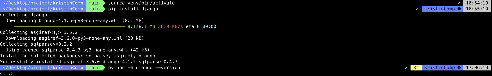
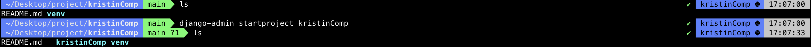
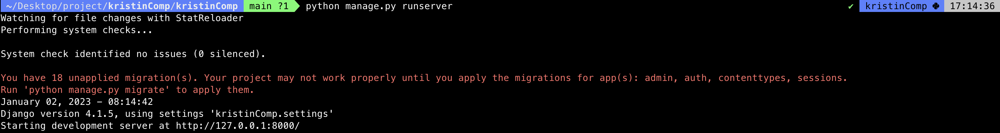
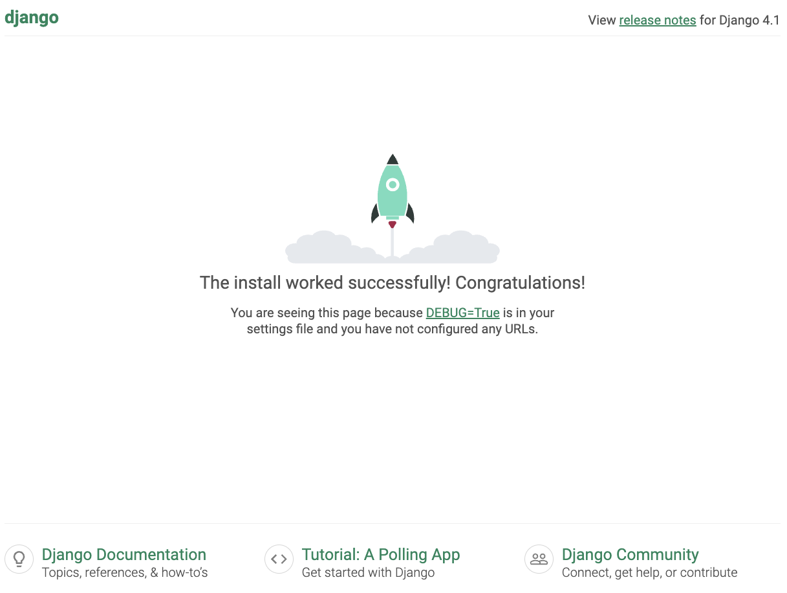

<!-- 양식

[사진 첨부]

[참고 문헌]

[파이썬 딕셔너리 사용하기 dict](https://jvvp.tistory.com/998) 

-->

## Intro

---

nodeJS 위주로 개발할때는 굳이 가상환경 까지 세팅하지 않았다.

회사용 pc와 개인 pc 를 완전히 따로 쓰고 있어서 버전으로 인한 이슈를 겪은적이 별로 없었던것 같다.

Django를 배우면서는 시작할때 부터 가상환경을 완전히 세팅 해놓고 시작하는게 어색한거 같다.

### 가상환경

---

- 왜 가상환경을 세팅하는가?
    - 개발을 하는 프로젝트마다 환경을 독립적으로 가져가기 위해서 세팅한다.
    - 가상환경을 세팅하지 않으면 여러가지 프로젝트를 진행할때 계속 설치되는 라이브러리가 쌓여 특정 라이브러리를 사용하지 않는 경우에도 설치가 되어 있다.
    - 혹은 파이썬을 프로젝트별로 다  버전을전 해야 하는데 그 때마다 파이썬버전을바꿔줘야 한다.

### virtualenv 설치하기

---

- 가상환경을 세팅하기 위해서 virtualenv 설치가 필요하다.
    
    `pip3 install virtualenv`
    
    
    

### 가상환경(venv) 생성하기

---

- `virtualenv` 를 활용하여 가상 환경을 생성한다.
    
    `virtualenv venv --python=python3.10` 
    
    - `virtualenv` : 명령어
    - `venv` : 폴더명
    - `--pytyhon=python3.10` : 파이썬 버전 설정. 파이썬의 다른 버전으로 가상환경을 설정하고자 한다면 버전에 맞는 숫자로 변경하면 된다.

    

- 가상 환경을 생성하면 명령했던 이름으로 가상환경 폴더가 생성된다.

### 가상환경(venv) 실행하기

---

- `source` 명령어를 통해 생성한 가상환경 폴더 안에 `activate`  파일을 실행 시킨다. activate 파일은 bin 폴더 안에 있다.
    
    `source venv/bin/activate`
    
- 가상 환경을 실행하면 터미널에 가상환경이 실행중이라고 표시된다.
    - 윈도우의 경우 : (venv) project$ 처럼 표기됨
    - 맥의 경우 : 윈도우 처럼 표기 되거나 터미널 끝부분에 가상환경이 표기됨
    - 설정에 따라서 실행되고 있는 표기가 다 다르기 때문에 각자의 설정에 맞게 표기 되고 있는지 확인해보자.

    

- 내 경우엔 위 사진을 보면 ls를 했을때 뒤에 아무것도 표기되지 않지만, activate를 하고 나면 오른쪽에 무언가 생기고 있는것이 보인다.
- 가상환경 생성시 설정했던 파이썬 버전을 확인해 본다.

### 가상환경(venv) 해제하기

---

- `deactivate` 를 터미널에 치면 끝난다.

    

- 뒤에 가상환경 표시가 꺼진것을 확인할수 있다.

## outro

---

안해보면 두렵고 어려워 보이고 짜증나지만

막상 해보면 간단한 일들이 많은것 같다.

가상환경 잘못 만든다고 컴퓨터가 고장나는건 아니니 츄라이 해보자.