# Intro
독특한 무중단 배포에 대해서 설명해 보고자 한다.
일반적으로 무중단 배포는 쿠버네티스 혹은 엔진엑스를 통해 많이 설정한다.
나도 처음에는 이렇게 설정하려고 했으나,
쿠퍼네티스는 회사에서 사용하고 있지 않았고,
엔진엑스는 로드벨런서를 사용하고 있는 상황에서 비효율적인 느낌을 받아서 사용하지 않았다.

# 환경 조건
AWS LoadBalancer, AWS AutoScaling, Docker


# 배포 방법
## 배포 준비
### 1. 로드벨런서 세팅
- ec2 이미지 생성
- 해당 이미지로 시작 템플릿 생성

### 2. EC2 생성 및 세팅
- EC2의 사용자 데이터를 통해 인스턴스 시작할때 바로 docker-compose 실행 되도록 설정
- 인스턴스가 시작 할때  명령 실행
	- git pull 받을수 있는 실행 명령
	- docker-compose 실행 명령
```bash
Content-Type: multipart/mixed; boundary="//"
MIME-Version: 1.0

--//
Content-Type: text/cloud-config; charset="us-ascii"
MIME-Version: 1.0
Content-Transfer-Encoding: 7bit
Content-Disposition: attachment; filename="cloud-config.txt"

#cloud-config
cloud_final_modules:
- [scripts-user, always]

--//
Content-Type: text/x-shellscript; charset="us-ascii"
MIME-Version: 1.0
Content-Transfer-Encoding: 7bit
Content-Disposition: attachment; filename="userdata.txt"

#!/bin/bash
cd /home/ubuntu/trend-back-api
sudo git pull origin main
sudo docker-compose build palette-prod
sudo docker-compose up -d palette-prod
--//
```
위 코드에서 실제로 내가 실행할 코드는
```
cd /home/ubuntu/trend-back-api
sudo git pull origin main
sudo docker-compose build palette-prod
sudo docker-compose up -d palette-prod
```
이 부분인데, 나머지 부분을 적어 주지 않으면 인스턴스가 시작될때 작동되지 않았다.

주의할 점음 이미지 안에 .env파일에 대한 확인과
docker 이미지, docker 컨테이너를 모두 삭제 해놓는다.
인스턴스가 켜질때 docker-compose build를 통해 이미지 생성하고 
docker-compose up을 통해 컨테이너가 생성되고 실행되기 때문에
이중 작업이 되지 않도록 주의 해야 한다.
### 3. EC2 이미지 생성
생성한 EC2 인스턴스를 기준으로 오토스케일링에 사용될 EC2 이미지를 생성 한다.

### 4. 오토스케일링 생성
생성한 EC2 이미지로 오토스케일링을 생성한다.

## 배포 순서

1. 오토스케일링 접속
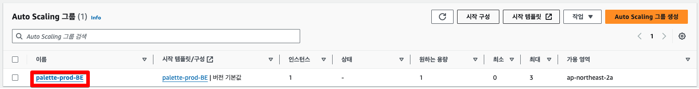

2. 세부정보 편집
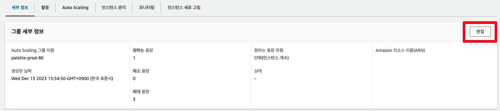

3. 용량 변경
- 기존 용량 1 → 변경 용량 2
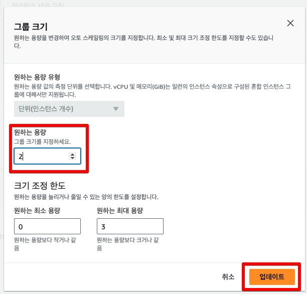

4. 로드밸런싱에서 대상그룹 확인
- 대상그룹 접속
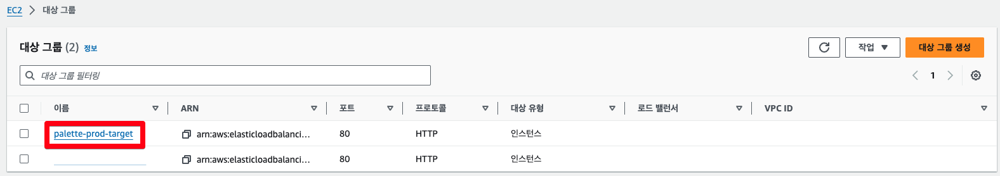
- 등록된 대상 확인 - 상태확인(health-check)
- 기존 서버는 Healthy로 나옴 → 인스턴스ID 확인하기
- 새 배포 서버는 Unhealthy로 나옴
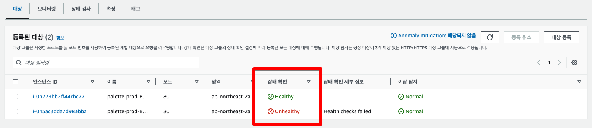

- 새 배포가 Healthy가 될때 까지 대기( 몇분 소요)
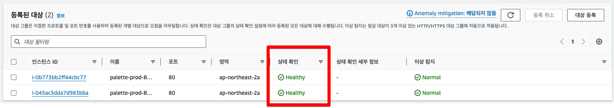

5. 기존 배포된 서버 인스턴스 종료
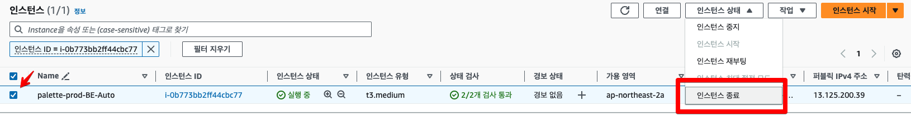
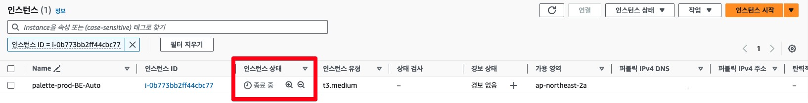

6. 로드밸런싱 - 대상그룹 확인
- 종료 되는데 시간이 걸리기 때문에 처음에는 기존 서버 상태와 동일
- 종료가 되면 대상그룹에 하나만 표시
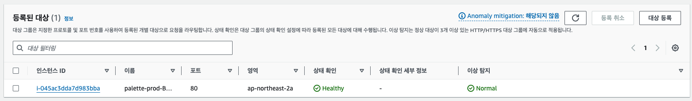

- 시간이 더 지나면 새로운 인스턴스 생성됨
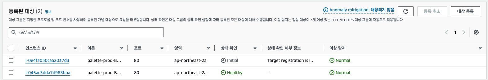
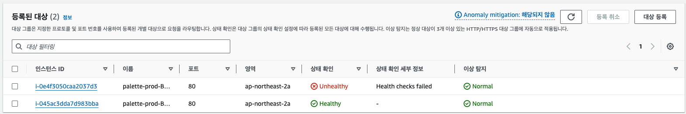

- 둘다 healthy가 될때 까지 대기
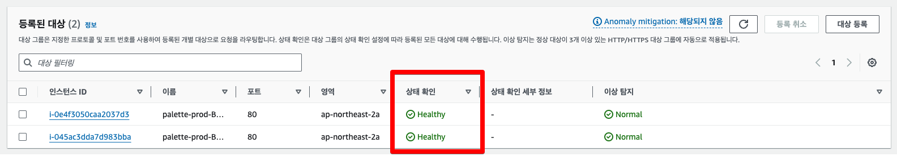

7. 오토스케일링 → 용량 변경
- 용량 다시 1개로 변경
  <img src="img/continuousDeployment_13.png]]

# 배포 관련 QnA
위 방법에 대해 예상되는 질문에 답을 하면,
1. 대상 그룹에서 상태 확인에 처음 unhealthy가 뜨는 이유?
	- 인스턴스가 시작되면 인스턴스 내부에서는 git pull, docker-compose build, docker-compose up 이 자동으로 진행된다.
	- 이 과정이 모두 끝나야 health-check가 정상적으로 작동하기 때문에 이 시간동안에는 unhealthy 상태이다.
2. 기존 인스턴스 종료 후 왜 인스턴스 2개가 정상적으로 뜰때까지 기다린후 오토스케일링은 1개로 조정 하는가?
	- 우선 인스턴스를 1개로 줄이면 오토스케일링 때문에 인스턴스가 1개가 바로 생성된다.
	- 이때 오토스케일링에서 용량을 줄이게 되면 생성중인 인스턴스를 놔두고 정상적인 인스턴스를 삭제할수가 있다.
	- 안정적인 무중단 배포를 위해 확실한 서버 2개를 띄운후 1개로 조정해야 한다.
1. Nginx를 사용하지 않은 이유?
	- ssl 인증을 위해 이미 로드밸런서를 이용중이다.
	- Nginx를 통해 롤링배포를 할 경우 장점은 하나의 인스턴스에서 이루어져서 리소스가 더 저럼하다는 장점이 있다.
	- 단점은 한정된 인스턴스 리소스에서 진행되니 빌드 과정에서 메모리를 많이 사용하게 될 경우 서버 자체가 멈출수 있는 위험이 있다.