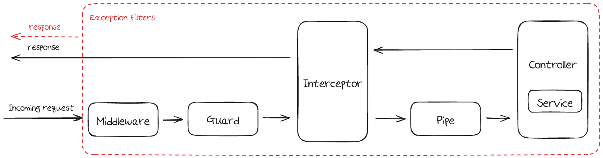

<br>

# Request lifecycle

Nest는 **요청 수명 주기**라고 하는 순서에 따라 요청을 처리하고 응답을 생성한다. 

middleware, pipes, guards, interceptors를 사용하면 global, controller, route 단계에서 작동할 때 
요청 수명 주기 동안 특정 코드 조각이 실행되는 위치를 추적하는 것이 어려울 수 있다. 

일반적으로 요청은 middleware 통해 가드, guards, pipes, 마지막으로 반환 경로의 interceptors로 이동한다.

<br>

## Middleware[#](https://docs.nestjs.com/faq/request-lifecycle#middleware)
lifeCycle 내 모든 역활을 Middleware로 구현 가능하다.

미들웨어는 특정 순서로 실행된다.

먼저 Nest는 전역적으로 바인딩된 미들웨어(예를 들어 `app.use`로 바인딩된 미들웨어)를 실행한 다음경로에서 결정되는 [모듈 바인딩 미들웨어](https://docs.nestjs.com/middleware)를 실행한다.

미들웨어는 Express의 미들웨어 작동 방식과 유사하게 **바인딩 순서대로** 순차적으로 실행된다.

서로 다른 모듈에 바인딩된 미들웨어의 경우 루트 모듈에 바인딩 된 미들웨어가 먼저 실행된 다음 모듈이 **imports 배열에 추가된 순서대로** 미들웨어가 실행된다.

## Guard[#](https://docs.nestjs.com/faq/request-lifecycle#guards)

Request를 확인하고 수정할수 있다.

User Gaurd를 만들어서 헤더에 포함된 토큰의 유효성과 권한을 확인하고
인증된 유저의 정보를 Request에 포함하면 이후 유저 정보를 쉽게 활용할수 있다.

미들웨어와 마찬가지로 가드는 바인딩된 순서대로 실행된다.

예를 들어

```typescript

@UseGuards(Guard1, Guard2)
@Controller('cats')
export class CatsController {
  constructor(private catsService: CatsService) {}

  @UseGuards(Guard3)
  @Get()
  getCats(): Cats[] {
    return this.catsService.getCats();
  }
}
```

이 코드에서 `Guard1` >  `Guard2` > `Guard3`보다 순서로 실행된다.

> global 바인딩과 controller 또는 로컬 바인딩에 대해 말할 때 차이점은 가드(또는 다른 구성 요소)가 바인딩되는 위치입니다.
> 
> 모듈을 통해 구성 요소를사용`app.useGlobalGuard()`하거나 제공하는 경우 전역적으로 바인딩됩니다.
> 
> 그렇지 않은 경우 decorator controller 클래스보다 앞에 있으면 controller에 바인딩되고, decorator 경로 선언 앞에 있으면 경로에 바인딩됩니다.


<br>

## Interceptor[#](https://docs.nestjs.com/faq/request-lifecycle#interceptors)

Interceptor 는 request와 response시에 중간에서 값을 Intercept 한 뒤, 보내는 역할을 한다.

그렇기에 Interceptor는 추가적인 로직이 필요한 경우 사용한다.

Interceptor를 쓰는 대표적 케이스가 바로 Logger이다.

Logger의 경우 request에 대한 정보, response에 대한 정보를 logging을 해야 하기에 Interceptor로 구현하기 알맞은 경우다.


> **NestJS 디스코드 채널 질문 답변**
> 
> Q. “Interceptor와 Middleware의 가장 큰 차이는 무엇인가요?”
> 
> A. Middleware는 파라미터로 request, response, next 이 세 가지를 받는데요,
> 
> NestJS에서 request와 response가 HTTP 위에서 동작하게 설계되어 있기 때문에 HTTP 통신이 아니면 사용이 불가합니다.
> 
> 반면에 Interceptor는 파라미터로 execution context라는 helper class를 받아 처리하기 때문에 HTTP 이외에도 WebSocket, GraphQL, RPC(Remote procedure call) 위에서도 동작 가능합니다.
> 
> 이 외에도 Middleware, Guards, Interceptors, Pipes, Filters는 기술적으로 모두 NodeJS에서 말하는 Middleware에 속하지만,
> 
> NestJS에선 Guards, Interceptors, Pipes, Filters를 enhancer라고 부르며,
> 
> 꼭 Middleware가 필요한 경우가 아니라면 enhancer 쓰길 권장하고 있습니다.


<br>

## Pipe[#](https://docs.nestjs.com/faq/request-lifecycle#pipes)

파이프는 보통 두 가지로 사용된다.

- **변환(transformation)**: 입력 데이터를 원하는 형식으로 변환(예: 문자열에서 정수로).

- **유효성 검사(validation)**: 입력 데이터를 평가하고 유효한 경우 변경하지 않고 그대로 전달. 유효하지 않으면 예외를 발생.

두 경우 모두 controller route handler에 인수에 대해서 작동한다.

그래서 pipe에서 exception이 발생하면 controller는 실행되지 않는다.

<br>

## Exception Filter[#](https://docs.nestjs.com/faq/request-lifecycle#filters)

Exception Filter의 특징은 다음과 같다.

- Exception Filter는 global을 우선 해결하지 않는다.

- try/catch로 처리하지 않는 오류 발생시 실행된다.

- life cycle내의 어떤 단계에서든 Exception filter가 실행될수 있다.

- Exception filter가 실행시 이후 모든 단계를 스킵하고 해당 Exception을 Response 한다.

- route가 예외를 포착하는 경우 controller 또는 global 필터는 동일한 예외를 포착할 수 없다.
    - 동일한 예외를 포착하려면 필터 간에 상속을 사용해야 한다.

<br>

## Summary[#](https://docs.nestjs.com/faq/request-lifecycle#summary)

마지막으로 nestJS 공식 페이지에 올라온 Summary이다.

<br>

In general, the request lifecycle looks like the following:

1. Incoming request
2. Middleware
    - 2.1. Globally bound middleware
    - 2.2. Module bound middleware
3. Guards
    - 3.1 Global guards
    - 3.2 Controller guards
    - 3.3 Route guards
4. Interceptors (pre-controller)
    - 4.1 Global interceptors
    - 4.2 Controller interceptors
    - 4.3 Route interceptors
5. Pipes
    - 5.1 Global pipes
    - 5.2 Controller pipes
    - 5.3 Route pipes
    - 5.4 Route parameter pipes
6. Controller (method handler)
7. Service (if exists)
8. Interceptors (post-request)
    - 8.1 Route interceptor
    - 8.2 Controller interceptor
    - 8.3 Global interceptor
9. Exception filters
    - 9.1 route
    - 9.2 controller
    - 9.3 global
10. Server response

<br>

### 참고
[nestJS 공식 문서](https://docs.nestjs.com/faq/request-lifecycle)
[Nestjs - Interceptor](https://velog.io/@atesi/Nestjs-Interceptor)
[NestJS를 사용해야 하는 이유](https://brunch.co.kr/@subinkr/3)
[NestJS Interceptor와 Lifecycle](https://blog-ko.superb-ai.com/nestjs-interceptor-and-lifecycle/)
