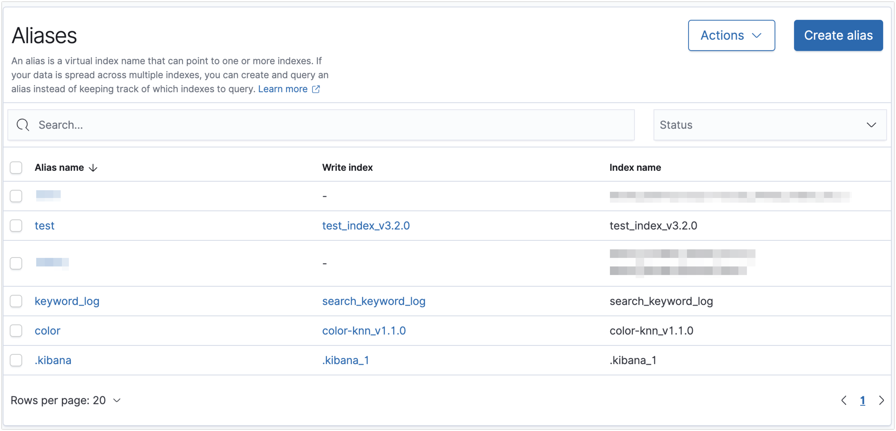
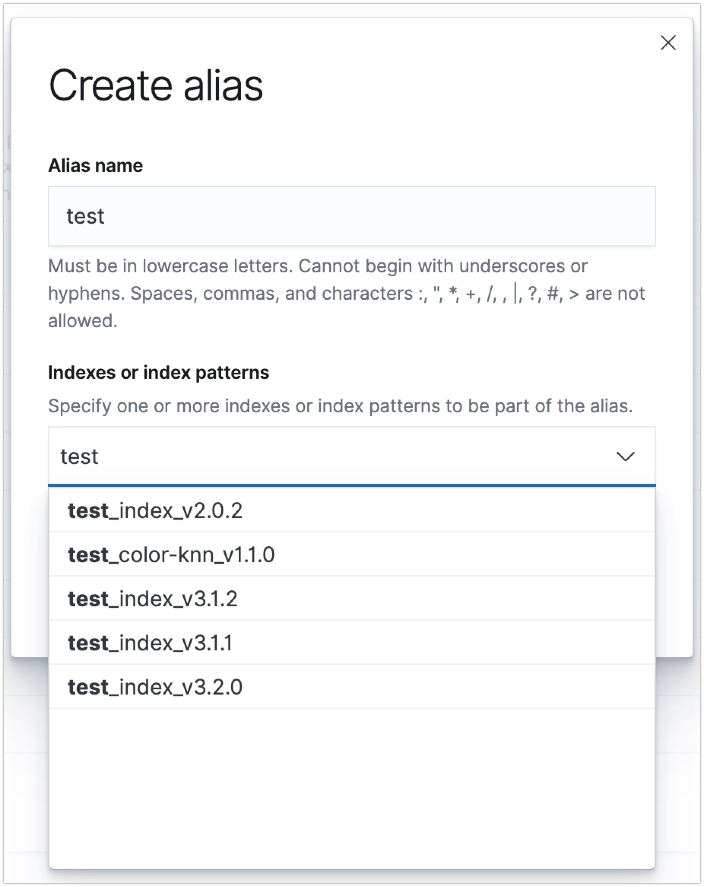

# Alias
- Elasticsearch에서 Alias는 하나 이상의 인덱스를 참조할 수 있는 이름
- 인덱스를 리네임하지 않고도 인덱스 간의 투명한 변경을 할 수 있음
- Alias는 특정 인덱스에 읽기, 쓰기 작업을 더 쉽게 할 수 있고, 인덱스 관리의 유연성을 높임

<br>

## Alias의 주요 기능

1. **다중 인덱스 참조**: 하나의 Alias가 여러 인덱스를 참조
2. **필터링**: Alias에 특정 쿼리 필터를 적용하여 데이터의 서브셋만을 노출
3. **라우팅**: Alias를 통해 문서의 색인 및 검색 작업을 특정 샤드로 라우팅

<br>

## Alias 사용 예시

<br>

### 1. 기본 Alias 생성
- `my_index`라는 인덱스에 `my_alias`라는 Alias를 생성
```
POST /my_index/_alias/my_alias
```

<br>

### 2. Alias를 통한 데이터 검색

```
GET /my_alias/_search
```

위 명령어는 `my_alias`로 설정된 인덱스에서 데이터를 검색한다.
Alias를 통해 인덱스를 추상화하여 사용할 수 있다.

<br>

### 3. 여러 인덱스에 Alias 적용
```
POST /_aliases
{
  "actions": [
    { "add": { "index": "index_1", "alias": "my_alias" } },
    { "add": { "index": "index_2", "alias": "my_alias" } }
  ]
}

```

위 명령어는 `index_1`과 `index_2`라는 두 인덱스에 `my_alias`를 추가한다. 

이제 `my_alias`를 사용하여 두 인덱스를 모두 참조할 수 있다.

<br>

### 4. 필터를 적용한 Alias
```
POST /my_index/_alias/my_filtered_alias
{
  "filter": {
    "term": {
      "user": "Jack"
    }
  }
}

```

위 명령어는 `my_index` 인덱스에 `my_filtered_alias`라는 Alias를 생성하며, `user` 필드가 `Jack`인 문서만 필터링하여 검색할 수 있도록 한다.

<br>

### 5. Alias를 통한 색인
```
POST /my_alias/_doc/1
{
  "field1": "value1"
}

```

위 명령어는 `my_alias`를 통해 문서를 색인한다. 이 Alias가 참조하는 인덱스에 문서가 추가된다.

> [!INFO]
> Alias를 통해 문서를 색인할 때, Alias가 여러 인덱스에 매핑되어 있다면, 기본적으로 색인은 실패한다.
> 반드시 1:1 매칭 되어 있을때만 색인이 가능하다.

<br>

### 6. Alias 업데이트

Alias를 업데이트하려면 기존 Alias를 제거하고 새로 추가해야 한다.
예를 들어, `my_alias`를 `index_3`로 이동하려면:
`my_alias`를 `index_1`과 `index_2`에서 제거하고, `index_3`에 추가 한다.
```
POST /_aliases
{
  "actions": [
    { "remove": { "index": "index_1", "alias": "my_alias" } },
    { "remove": { "index": "index_2", "alias": "my_alias" } },
    { "add": { "index": "index_3", "alias": "my_alias" } }
  ]
}

```

<br>

### 7. dashboard를 통한 alias 관리

이 외에도,
opensearch dashboard에서 alias를 바로 관리 할수 있다.
`Index Management` → `Aliases` 항목으로 이동하면 아래 그림과 같이 alias 설정된 List를 볼수 있고 쉽고 편하게 관리가 가능하다.





<br>

## Alias의 장점

1. **유연한 인덱스 관리**: 인덱스의 이름을 변경하지 않고도 Alias를 통해 간편하게 인덱스를 참조
2. **무중단 인덱스 교체**: 새로운 인덱스를 생성하고 Alias를 업데이트함으로써 애플리케이션의 중단 없이 인덱스 교체
3. **데이터 분할 및 접근 제어**: 필터링 기능을 통해 특정 조건에 맞는 데이터만 접근할 수 있도록 설정
4. **간편한 라우팅 설정**: 라우팅 기능을 통해 색인 및 검색 작업을 특정 샤드로 유도


<br>

*해당 글은 chatGPT를 기반으로 작성되었습니다.*
