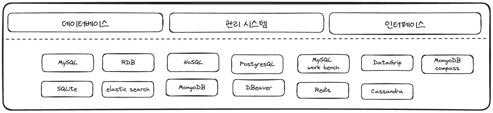
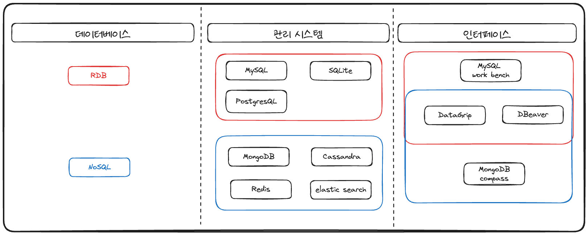

### **데이터베이스(Database), 관리 시스템(DBMS), 인터페이스(Interface): 혼동하지 말자**

데이터베이스(Database), 데이터베이스 관리 시스템(DBMS), 그리고 인터페이스는 데이터 관리와 관련된 기본적인 용어들이지만, 이 세 가지를 헷갈려 하는 경우가 많다. 

특히 데이터베이스와 DBMS, 그리고 이들을 제어하는 인터페이스를 혼동하면 데이터 관리의 개념을 정확하게 이해하기 어려울 수 있다.

위 그림에서 정확하게 분류를 할수 있다면 굳이 이 글을 읽지 않아도 된다.

조금 헷갈린다면, 이 세 가지를 명확하게 구분하여 설명하고, 각자의 역할과 차이점을 살펴보자.

 

### **1. 데이터베이스(Database): 데이터의 집합**

**데이터베이스**는 데이터를 체계적으로 저장한 공간이다.

쉽게 말해, 데이터베이스는 데이터를 담고 있는 **저장소**로, 다양한 유형의 데이터를 효율적으로 저장, 관리, 검색할 수 있게 해준다.

이는 한 회사의 고객 정보, 상품 목록, 주문 내역 등의 데이터를 저장하는 곳이 될 수 있다.

데이터베이스의 종류는 다양하다. 대표적인 유형으로는 **관계형 데이터베이스(RDB)**와 **비관계형 데이터베이스(NoSQL - Not Only Structured Query Language)**가 있다.

- **관계형 데이터베이스(RDBMS)**는 데이터를 **테이블 형식**으로 저장하고, 테이블 간의 관계를 정의한다.
  (예: **MySQL, PostgreSQL**)
- **비관계형 데이터베이스(NoSQL)**는 테이블이 아닌 다양한 방식으로 데이터를 저장하는 것을 의미한다.
  (예: **MongoDB**)

> **한 줄 요약**: 데이터베이스는 데이터를 저장하는 **그릇**

 

### **2. 데이터베이스 관리 시스템(DBMS-Database Management System): 데이터의 관리자**

**데이터베이스 관리 시스템(DBMS)**는 데이터베이스를 제어하고 관리하는 **소프트웨어** 다.

DBMS는 데이터의 저장, 검색, 수정, 삭제 같은 작업을 쉽게 처리할 수 있게 해주는 역할을 한다.

사용자는 DBMS를 통해 데이터베이스와 상호작용하며, 데이터를 처리하거나 관리할 수 있다.

데이터베이스가 실제 데이터를 저장하는 곳이라면, **DBMS는 데이터를 관리하고 접근하는 도구**이다.

이를 통해 데이터를 효율적으로 처리하고, 여러 사용자에게 동시 접근을 허용하거나 데이터의 무결성을 유지할 수 있다.

- **예시**: MySQL, Oracle, PostgreSQL, MongoDB, Redis

DBMS는 사용자가 데이터를 어떻게 저장되는지에 대한 방식을 결정하며, 각 DBMS는 특정 저장 구조(테이블, 문서, 키-값 등)를 제공한다. 

사용자는 DBMS를 통해 데이터를 효과적으로 관리하고, 필요에 따라 데이터를 처리하고 저장할 수 있다.

DBMS는 데이터를 보호하고 최적화된 방식으로 관리함으로써, 사용자가 필요로 하는 데이터를 정확하게 제공하는 역할을 한다.

> **한 줄 요약**: DBMS는 데이터베이스를 효율적으로 관리하고 제어하는 **소프트웨어**

---

### **3. 인터페이스(Interface): 데이터를 다루는 사용자 도구**

**인터페이스**는 **사용자와 DBMS 사이의 다리** 역할을 한다.
인터페이스는 사용자가 DBMS를 더 쉽게 사용할 수 있도록 돕는 도구로, 주로 **GUI(그래픽 사용자 인터페이스)** 형태로 제공된다.
인터페이스를 통해 사용자는 쿼리를 작성하거나 데이터를 시각적으로 확인하고, 필요한 데이터를 조회하거나 수정할 수 있다.

**MySQL Workbench**와 같은 도구는 사용자가 MySQL DBMS에 접근하여 데이터를 쉽게 관리할 수 있도록 해준다. **MongoDB Compass**는 MongoDB와 상호작용할 수 있게 해주는 GUI 도구이다. 이러한 인터페이스는 사용자가 복잡한 명령어 없이도 데이터를 관리할 수 있도록 지원하여, 비전문가도 쉽게 데이터베이스를 다룰 수 있게 만들어준다.

> **한 줄 요약** : 인터페이스는 사용자가 DBMS와 상호작용할 수 있도록 돕는 **도구**

---

### **이 세 가지의 관계**

데이터베이스, 관리시스템, 인터페이스의 관계
- **데이터베이스(Database)**는 데이터를 저장하는 그릇이며, **관리시스템(DBMS)**은 그 그릇을 관리하는 소프트웨어이다.
- **인터페이스(Interface)**는 사용자가 DBMS와 데이터를 쉽게 상호작용할 수 있도록 도와주는 도구이다.

쉽게 비유하자면, **데이터는 도서관의 책**, **데이터베이스는 도서관**, **관리시스템(DBMS)은 도서관 사서**, 그리고 **인터페이스는 카탈로그나 도서 검색기**에 해당한다.
사용자는 도서 검색기를 통해 원하는 책(데이터)을 찾고, 사서(DBMS)는 그 책을 정확하게 찾아 제공한다.

---

### **실제 예시**

#### 관계형 데이터베이스 (RDBMS) 예시:
- **데이터베이스**: MySQL에 저장된 고객 정보 데이터
- **DBMS**: MySQL
- **인터페이스**: MySQL Workbench를 통해 데이터를 쉽게 관리

#### 비관계형 데이터베이스 (NoSQL) 예시:
- **데이터베이스**: MongoDB에 저장된 제품 정보
- **DBMS**: MongoDB
- **인터페이스**: MongoDB Compass를 사용해 데이터를 조회 및 수정

> DataGrip은 InteliJ에서 제공하는 유로 프로그램이며, DBeaver는 무료(MySQL)툴이지만 일부(NoSQL)기능은 유료이다.
---

### **결론**

데이터베이스(Database), 데이터베이스 관리 시스템(DBMS), 그리고 인터페이스(Interface)는 데이터 관리 시스템의 필수적인 구성 요소이다. 이 세 가지는 각각의 역할이 다르며, 이를 명확하게 이해해야 데이터 관리의 기본 개념을 정확히 파악할 수 있다.

데이터를 **저장**하는 공간이 데이터베이스, 그 공간을 **관리**하는 소프트웨어가 DBMS, 그리고 그 소프트웨어를 **쉽게 사용하는 도구**가 인터페이스이다. 이러한 개념을 제대로 이해하면, 데이터베이스 환경에서의 복잡한 용어들 속에서도 길을 잃지 않고 효율적으로 데이터를 관리할 수 있을 것이다.
