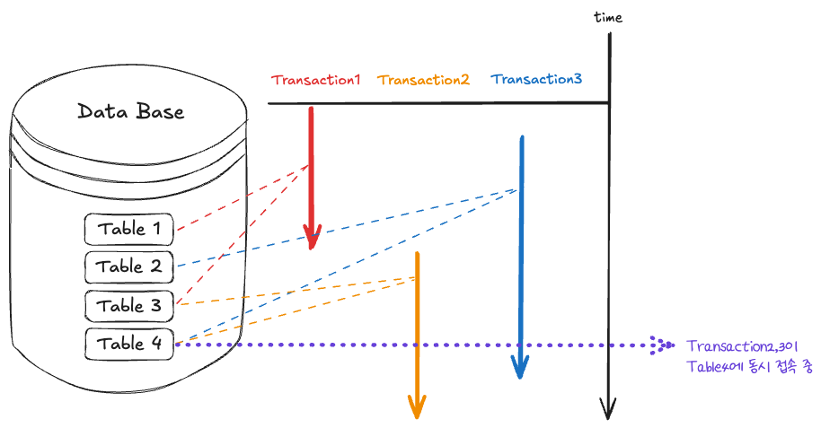
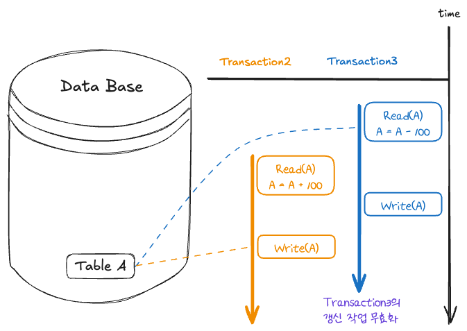
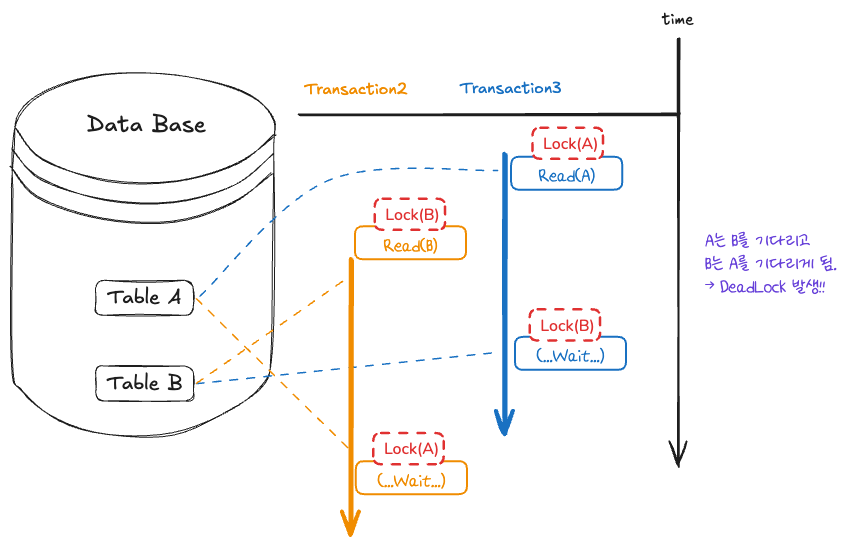

<br>


# Transaction 
transaction는 데이터베이스 내에서 수행되는 작업의 최소 단위로, 데이터베이스의 무결성을 유지하며 DB의 상태를 변화시키는 기능을 수행한다. 
transaction은 하나 이상의 query를 포함해야 하고, ACID라고 칭해지는 원자성, 일관성, 고립성, 지속성의 4가지 규칙을 만족해야 한다.

은행 시스템에서 A가 100만원을 출금해서 B에게 입금하는 상황을 생각해 보자. 
A의 잔고에서 100만원을 출금하였는데, 이 때 전산오류가 생겨서 B의 계좌에는 100만원이 입금 되지 않았다. 
이런 상황은 전산시스템의 치명적인 오류이다. 
이렇게 예상치 못하게 오류가 발생하여 하여 데이터의 부정합이 발생하는 경우, 다시 원상복귀 해야한다. 
따라서 모든 입출금은 하나의 묶음 형태로 작동해야 한다. 출금을 했으면 입금을 마치던지 아니면 아예 없던 일이 되어야 한다. 
이런 식으로 두 행위는 분리될 수 없는 하나의 거래로 처리돼야 하는 단일 업무 이다. 
이러한 **업무 처리의 최소 단위**를 데이터베이스에서는 **transaction**이라고 한다.

데이터베이스에서 Transaction이 필요한 이유는 데이터를 다룰 때 장애가 일어나는 경우 transaction은 장애 발생시 데이터를 복구하는 작업의 단위가 되기 때문이다. 또한 데이터베이스에서 여러 작업이 동시에 같은 데이터를 다룰 때가 있다. transaction을 통해 이 작업을 서로 분리하고, 이를 통해 오류가 발생하지 않게 합니다. DBMS는 transaction이 이러한 규칙을 유지하도록 지원한다.


```SQL
START TRANSACTION;

-- (1) A 계좌 잔액 가져옴 A = 1000
-- (2) B 계좌 잔액 가져옴 B = 1000
SELECT balance INTO @A_balance FROM Customer WHERE name = 'A';
SELECT balance INTO @B_balance FROM Customer WHERE name = 'B';


-- (3) A 출금 A = A - 100
-- (4) B 입금 B = B + 100
UPDATE Customer SET balance = balance - 100 WHERE name = 'A';
UPDATE Customer SET balance = balance + 100 WHERE name = 'B';


-- (5) A 계좌 잔액 저장 A = 900
-- (6) B 계좌 잔액 저장 B = 1100
SELECT balance INTO @A_new_balance FROM Customer WHERE name = 'A';
SELECT balance INTO @B_new_balance FROM Customer WHERE name = 'B';


COMMIT;

```


<br>


### ACID

트랜잭션은 데이터베이스의 무결성을 유지하기 위해 원자성, 일관성, 고립성, 지속성의 성질을 갖는다.

- Atomicity(원자성) : transaction에 포함된 작업은 전부 수행되거나 아니면 전부 수행되지 말아야 한다._(all or nothing)_
    
- Consistency(일관성): transaction이 실행을 성공적으로 완료하면 언제나 일관성 있는 데이터베이스 상태로 유지하는 것을 의미한다. 송금 전후 모두 잔액의 data type은 integer이여야 한다는 것이 일관성의 한 예가 될 수 있다.
    
- Isolation(고립성): 여러 Transaction은 동시에 수행된다. 이때 각 transaction은 다른 transaction의 연산 작업이 끼어들지 못하도록 보장하여 독립적으로 작업을 수행한다. 따라서 동시에 수행되는 transaction이 동일한 data를 가지고 충돌하지 않도록 제어해줘야 한다. 이를 동시성제어(concurrency control) 라고 한다.
    
- Durability(지속성): 성공적으로 수행된 transaction은 데이터베이스에 영원히 반영되어야 함을 의미한다. transaction이 완료되어 저장이 된 데이터베이스는 저장 후에 생기는 정전, 장애, 오류 등에 영향을 받지 않아야 한다.
    



<br>

### 동시성 제어(concurrency control)

여러 개의 transaction이 한 개의 데이터를 동시에 갱신(update)할 때 어느 한 transaction의 갱신이 무효화 될 수 있는데 이를 갱신손실이라고 한다. 동시성제어를 통해 갱신손실을 미리 막을 수 있다. 즉, transaction이 동시에 수행될 때 일관성을 해치지 않도록 transaction의 데이터 접근을 제어하는 DBMS의 기능을 동시성제어라고 한다.

갱신손실 문제를 해결하기 위한 방법중에 하나로 데이터를 수정중에 있는 transaction은 해당 데이터를 Lock으로 잠금장치를 하여 다른 Transaction이 접근하지 못하게 하는 방법이 있다. Lock이 걸린 데이터는 Unlock이 될 때까지 다른 Transaction들은 접근하지 못하고 기다려야 한다.


```SQL
START TRANSACTION;

-- (1) A 계좌 잔액 가져옴 A = 1000
SELECT balance INTO @A_balance FROM Customer WHERE name = 'A';

-- (3) A 출금 A = A - 100
UPDATE Customer SET balance = balance - 100 WHERE name = 'A';

-- (5) A 계좌 잔액 저장 A = 900
SELECT balance INTO @A_new_balance FROM Customer WHERE name = 'A';

COMMIT;


START TRANSACTION;

-- (1) A 계좌 잔액 가져옴 A = 1000
SELECT balance INTO @A_balance FROM Customer WHERE name = 'A';

-- (3) A 출금 A = A + 100
UPDATE Customer SET balance = balance + 100 WHERE name = 'A';

-- (5) A 계좌 잔액 저장 A = 1100
SELECT balance INTO @A_new_balance FROM Customer WHERE name = 'A';

COMMIT;

```


<br>





<br>


```sql
START TRANSACTION;

-- (1) A 계좌 잔액 가져옴 A = 1000
SELECT balance INTO @A_balance FROM Customer WHERE name = 'A' FOR UPDATE;

-- (3) A 출금 A = A - 100
UPDATE Customer SET balance = balance - 100 WHERE name = 'A';

-- (5) A 계좌 잔액 저장 A = 900
SELECT balance INTO @A_new_balance FROM Customer WHERE name = 'A';

COMMIT;


START TRANSACTION;

-- (1) A 계좌 잔액 가져옴 A = 900
SELECT balance INTO @A_balance FROM Customer WHERE name = 'A' FOR UPDATE;

-- (3) A 출금 A = A + 100
UPDATE Customer SET balance = balance + 100 WHERE name = 'A';

-- (5) A 계좌 잔액 저장 A = 1000
SELECT balance INTO @A_new_balance FROM Customer WHERE name = 'A';

COMMIT;

```


<br>


<br>

### COMMIT과 ROLLBACK

데이터베이스는 COMMIT과 ROLLBACK 명령어를 통해 **데이터 무결성을 보장**한다. 
COMMIT이란 transaction 작업을 완료했다고 확정하는 명령어이다. transaction 작업 내용을 실제 DB에 저장하고, DB가 변경된다. ROLLBACK은 작업 중 문제가 발생했을 때, transaction 처리 과정에서 발생한 **변경 사항을 취소**하고, 이전 COMMIT의 상태로 되돌린다.


<br>


---


<br>


# Dead Lock

데이터베이스 deadlock(교착 상태)이란, 여러 transaction들이 각각 자신의 데이터에 대하여 lock을 획득한 상태에서 상대방 데이터에 대하여 접근하고자 대기를 할 때 교차 대기를 하게 되면서 서로 **영원히** 기다리는 상태를 말한다.

두 transaction이 각각 lock을 설정하고, unlock을 하지 않은 상태에서 서로의 lock이 걸린 데이터에 접근하려고 할 때, 서로 대기를 계속하여 영원히 처리되지 않는 상황이 발생한다.


<br>





<br>


deadlock을 해결하는 방법은 다음과 같다.

1. 예방기법: 각 transaction이 실행되기 전에 필요한 데이터를 모두 Locking 해주는 것입니다. 하지만 locking해줘야 하는 데이터가 많다면 사실상 모든 데이터를 전부 locking한 것과 동일하여 transaction의 병행성을 보장하지 못할 수 있다.
2. 회피기법: 자원을 할당할 때 timestamp를 사용하여 데드락 발생 가능성을 계산 해서 deadlock이 일어나지 않도록 회피하는 방법이다.
3. 탐지/회복 기법: Transaction이 실행되기 전에는 아무런 검사를 하지 않고, deadlock이 발생하면 이를 감지하고 회복시키는 방법이다. 즉, 데드락을 허용한 뒤, 주기적으로 탐지하여 해결한다.


---

### 1. 데드락 예방(Prevention)

데드락 예방은 데드락이 발생하는 4가지 조건 중 하나 이상을 사전에 차단하여 데드락 자체를 방지하는 방법입니다.

#### 1.1 상호 배제(Mutual Exclusion) 차단

자원은 한 번에 한 트랜잭션만이 사용할 수 있다는 조건을 제거하는 방식입니다. 즉, 공유 자원을 여러 트랜잭션이 동시에 접근할 수 있도록 허용하는 것입니다.

- **예시**: 읽기 전용 자원(예: 데이터 조회)에서는 여러 트랜잭션이 동시에 해당 데이터를 읽을 수 있도록 하여 상호 배제를 없애고, 데드락이 발생하지 않도록 합니다.

#### 1.2 점유와 대기(Hold and Wait) 차단

트랜잭션이 자원을 가지고 있으면서 다른 자원을 기다리는 상황을 방지합니다. 이를 위해 트랜잭션이 시작할 때 필요한 모든 자원을 한꺼번에 요청하게 합니다. 자원을 모두 획득하지 못하면 트랜잭션은 자원을 점유하지 않고 대기합니다.

- **예시**: 트랜잭션 A가 자원 X와 Y를 모두 필요로 한다면, 트랜잭션이 시작할 때 두 자원을 동시에 요청합니다. 만약 X와 Y가 모두 사용 가능하지 않다면, 트랜잭션 A는 아예 시작하지 않고 대기하게 됩니다.

#### 1.3 비선점(Non-preemption) 차단

이미 점유된 자원을 강제로 회수하는 방식입니다. 즉, 다른 트랜잭션이 자원을 요구할 때, 해당 자원을 점유한 트랜잭션을 중단시켜 자원을 해제하게 만듭니다.

- **예시**: 트랜잭션 B가 자원 X를 사용하고 있을 때, 트랜잭션 A가 자원 X를 요구하면, 트랜잭션 B는 자원 X를 해제하고 대기 상태로 들어가고, 자원 X는 트랜잭션 A에게 할당됩니다. B는 X가 다시 사용 가능해질 때까지 대기합니다.

#### 1.4 순환 대기(Circular Wait) 차단

자원을 할당하는 순서를 미리 정해놓고, 모든 트랜잭션이 자원을 해당 순서에 따라 요청하도록 강제하여 순환 대기를 방지하는 방법입니다.

- **예시**: 자원 X와 자원 Y가 있을 때, 트랜잭션은 자원 X를 먼저 요청하고, 그다음에 자원 Y를 요청해야 합니다. 트랜잭션 A는 자원 X를 얻은 후 Y를 요청할 수 있지만, 반대로 트랜잭션 B는 자원 Y를 얻고 X를 요청할 수 없습니다. 이렇게 순서를 정해 순환 대기가 발생하지 않도록 합니다.

### 2. 데드락 회피(Avoidance)

데드락 회피는 자원 할당 시점에서 데드락이 발생할 가능성이 있는지 미리 검사하고, 데드락이 발생할 가능성이 있으면 자원 할당을 하지 않는 방법입니다. 대표적으로 **은행가 알고리즘(Banker's Algorithm)**이 있습니다.

#### 2.1 은행가 알고리즘 예시

은행가 알고리즘은 시스템이 안정적인 상태에 있는지 확인한 후에 자원을 할당하는 방식입니다. 트랜잭션이 자원을 요청할 때, 해당 요청을 승인하면 시스템이 데드락 상태로 갈 수 있는지 미리 확인한 뒤 자원을 할당합니다.

- **예시**: 은행이 대출을 해줄 때, 현재 자원을 대출한 후에도 모든 고객(트랜잭션)이 필요한 자원을 얻을 수 있다는 보장이 있으면 대출(자원 할당)을 승인합니다. 만약 어떤 자원을 대출하면 다른 고객이 더 이상 자원을 얻을 수 없게 되어 데드락이 발생할 수 있다면, 그 자원을 대출하지 않습니다.

### 3. 데드락 탐지 및 복구(Detection and Recovery)

이 방법은 데드락이 발생하는 것을 허용하지만, 주기적으로 데드락을 탐지하고 이를 해결하는 방식입니다. 탐지된 데드락을 해결하기 위해 트랜잭션을 강제로 종료하거나 일부 트랜잭션을 롤백하여 자원을 회수합니다.

#### 3.1 데드락 탐지 예시

데드락 탐지는 주로 **자원 할당 그래프(Resource Allocation Graph)** 를 사용합니다. 이 그래프는 각 트랜잭션이 어떤 자원을 점유하고 있고, 어떤 자원을 기다리고 있는지를 나타냅니다. 그래프에 순환(cycle)이 발생하면 데드락이 발생한 것으로 판단합니다.

- **예시**: 트랜잭션 A가 자원 X를 점유하고 있고, 자원 Y를 기다리는 상황이고, 트랜잭션 B는 자원 Y를 점유하고 자원 X를 기다린다면, A와 B 사이에 순환 대기가 발생하여 데드락이 생깁니다. 이 경우 시스템은 트랜잭션 A나 B를 강제 종료시키고 자원을 해제해 데드락을 해결합니다.

#### 3.2 데드락 복구 방법

- **트랜잭션 중단(Kill Transaction)**: 데드락에 관련된 트랜잭션 중 하나를 선택하여 강제로 중단시킵니다. 주로 자원을 가장 적게 사용한 트랜잭션이나 비용이 적은 트랜잭션을 선택합니다.
- **롤백(Rollback)**: 데드락에 관련된 트랜잭션을 이전 상태로 롤백하여, 자원을 해제한 후 다시 트랜잭션을 시도하게 합니다.