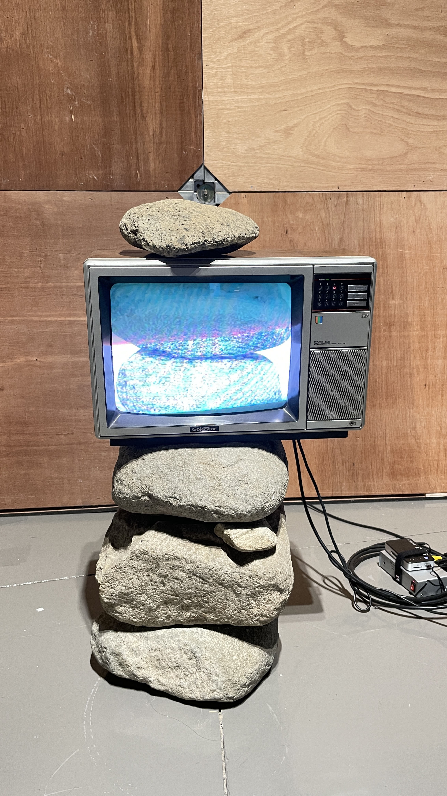
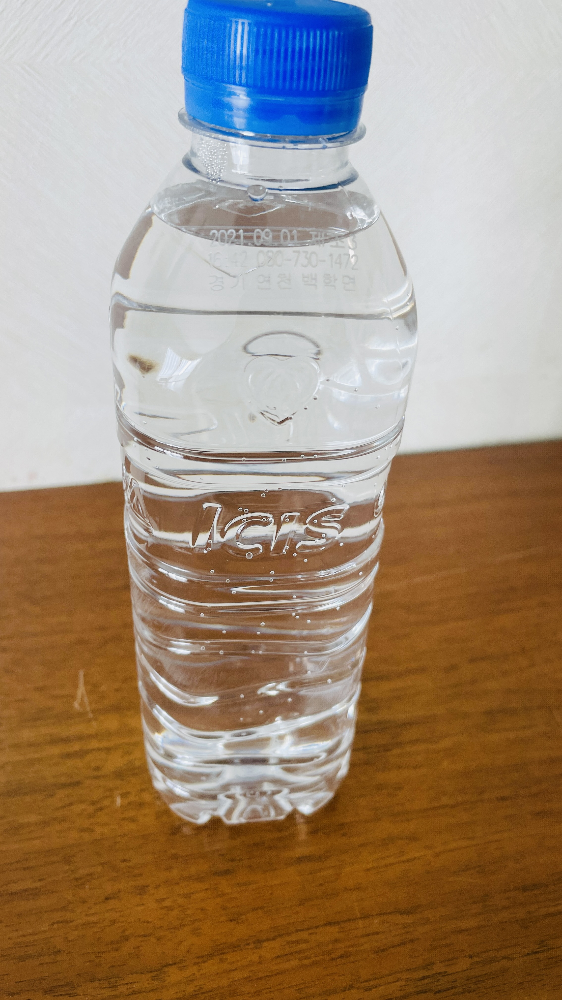

지금까지 생산방법은 어떻게 쓸것인가에 초첨이 맞추어져 온것같다.

얼마전에 미술관을 갔다 왓다. 오래만에 만난 친구와 심심해서 간 미술관이었다.

여러 전시관이 있었고 주제도 여러개였다. 첫번째로 들어갔던 전시관의 주제는 환경문제에 대해 경각심을 던지는 내용이었다.

전시 관람후 드는 생각은,

앞으로의 생산은 '어떻게 쓸것인가. 무엇을 쓸것인가'에 대한 내용이 아니라 '어떻게 버려야 할것인가'가 더 중요한 세상이 올것 같다.

사람은 쓰레기를 너무 많이 만든다. 지구의 자정 능력을 넘어설 정도로.

하지만 사람들이 예전에 기름이 부족해실것을 대비해서 태양광, 풍력, 원자력 등 여러 대체 에너지를 개발했듯이 이 환경 문제도 우리가 관심을 가지고 해결해 나간다면 해결할수 있을것이라고 생각한다.

그렇다면 어떻게?

소비자가 고민하게 하지 말자.

만드는 사람 따로 버리는 사람 따로다.

기업들은 제품을 찍어내면서, 버리는것에 대한 책임은 고객들의 몫이다.

이 부분이 정말 화가 난다.

만드는 단계에서 부터 어떻게 버려질지 고민해야 한다.

플라스틱에 비닐을 붙여놓고 사용자가 그걸 떼는 행위를 한다. 이 얼마나 무책임한가.

부지런한 사람들은 비닐과 플라스틱을 분리하겠지만, 게으른 사람들은 분리 하지 않고 그냥 버린다.

얼마전 한 영상을 봤는데 과자 비닐을 딱지로 접지 말라고 한다. 분리가 안된다고. 물론 이 사실은 잘못된 정보라는 다른 영상도 보게 되었지만, 그에 앞서 왜 사용자가 행위를 해야 할까.

어떻게 버릴지는 생산하는 기업에서 고민해야 한다.

소비자는 구매해서 사용하고 고민하지 않고 간단하게 버릴수 있도록 해야한다.

군대가 대단한 이유는 바보가 와도 제 몫을 할수 있게 시스템으로 만들어 져 있기 때문이다.

게으른 고객도 분리수거가 쉽게 되게 해야 한다.

내가 생각한 말도 안되는 직접적인 해결방안을 이곳에 끄적여 볼까 한다.

### 첫번째. 기업들의 재활용 용기 단일화

------

사람들이 가장 힘들어 하는 부분이 재활용이다. 재활용의 방법도 너무 많고 다양하다.

- 화장품 케이스 규제

화장품 병에 대한 규제도 심각하게 다루어져야 한다.

겉은 종이고 속은 플라스틱으로 된 화장품 케이스를 보았다. 안에 뭐가 들어있었는지는 잘 모르겟지만 종이와 플라스틱은 붙어 있었고, 두개가 떨어지지 않았다.

기본적으로 화장품 병들에 대한 규제 방향은 리필이다.

어느 용기를 가지고 가던지 리필을 할수 있게 하거나,

화장품 용기를 규격화 하여 용량별로 속만 채워넣을수 있도록 한다. 대표적인 예시가 주방세제이다. 모든 화장품이 주방세제 처럼 리필할수 있어야한다.

그럼에도 불구하고 케이스를 포기 하지 못하는 사람들이 있을것이다.

이런 부분에서 화장품 기업들은 케이스만 판매한다.

세트 구성품 도 화장품 케이스 + 화장품 으로 하여 이쁜 케이스를 한번 사면 버리지 않고 계속해서 사용할수 있도록 설계한다.

이렇게 되면 화장품 케이스에 각 기업들은 자기 브랜드 홍보를 위해서 케이스는 더 이쁘게 만들것이다.

- 음료수 병 규제

얼마전 생수를 마시게 되었는데 이미 비닐을 제거한 회사들이 있다. 제품명은 음각으로 기록했다. 생수라서 가능한가 싶기도 하지만, 음료수 페트병들이 지향해야 하는 방향이라고 생각된다.

페트병 뿐만 아니라 병음료도 마찬가지다. 병음료에 붙은 종이는 잘 떨어지지도 않을 뿐더러 재활용 할때 세척 뿐만 아니라 종이를 떼어내는 공정을 한번더 거쳐야 할 것 이다.

음료수의 경우 물론 식품 영양 표기 부분에서 문제가 될수 있다. 이런 부분들은 병뚜껑에 QR코드를 찍어 두어 스마트폰을 통해 바로 확인할수 있게 하는 등의 해결방안을 고민해 볼수 있다.

화장품 케이스와 음료수 병을 시작으로 케이스에 대한 규제를 하나씩 점차 늘려 나가야 한다.

### 두번째. 벌금 징수

------

규제 하기로 했으면 지키지 않은 기업들에 대해 벌금을 부과해야 한다.

당연하다고 생각할수 있지만, 기업들은 규제를 지키지 않았을때 부과되는 벌금보다 규제를 지키지 않음으로 매출 및 순이익이 더 높게 나온다면 벌금을 마땅히 낸다.

이에 적당한 벌금부과는 도움이 되지 않는다. 벌금 부과는 규제를 지키지 않은 제품의 생산 수에 맞춰 누진세 적용해야 한다. 공장 단위로 하루 최대생산량을 기준으로하여 처음에는 벌금이 낼만 하겠지만 점차 무거워 지는 벌금을 기업이 견디지 못해야 한다.

*(왜 전기세만 누진세로 적용하는가!!!!)*

반면 규제를 지켜 생산한 제품에 대해서는 세금 감면을 진행 한다. 생산후 5년동안 해당 제품 관련 세금은 감면해준다면 기업들은 기꺼이 변화에 참여 할것이다.

### 세번째. 투자

------

처음부터 모든 기업들이 재활용품 변화에 참여하지 않을것이다.

제품 자체에 대한 투자가 아닌 재활용기에 대한 연구 개발비를 징수한 벌금으로 투자한다.

첫번째 단계에 강제적으로 단일화를 시키고 나면, 그 안에서 기업들을 브랜드 홍보를 위해 디자인을 새롭게 할것이다.

예를 들면 페트병에 비닐을 붙이지 못하게 한다고 했을때, 어떻게 타사 제품과 구별할것인가?

비닐을 붙이지 않고 하나의 펫트병에 음양각을 새기고, 부분 염색이 가능한 플라스틱 병을 만들기 위해 개발비에 투자를 해야할것이다. 이런 투자를 거두어진 벌금으로 재활용품 생산을 위한 개발비 및 설비 투자비로 지원 한다면 많은 기업에서 동참할것이다.

아주 어릴때, 쓰레기 종량제 봉투라는 것이 존재하지 않았다.

부모님은 검은 봉투에 넣어서 버리셧던것으로 기억한다.

어느순간 부터 쓰레기 종량제 봉투가 생겨나고, 분리수거에 대한 사람들의 인식이 높아졌다.

그리고 이제 더 나은 환경을 위해 다시 한번 제도적 변화가 필요한 때라고 생각한다.

고민은 기업에서 하고,

고객은 환경 부담금을 낸다.

큰 고민과 많은 행위를 하지 않고 잘 버려진다면,

맑은 공기와 좋은 환경을 후대에 유산으로 물려줄수 있지 않을까?

10년 뒤에도 20년 뒤에도 맑은 하늘을 보고 싶다.
