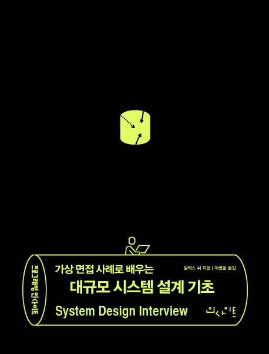

2021년 1월 개발자로 전향하기로 마음 먹고

2021년 2월 코드스테이츠에 신청하고

2021년 3월 코딩 공부를 시작하고

2021년 7월 코드스테이츠를 수료하고

2021년 11월 개발자로 취업에 성공 했다.

그리고 2022년 8월.

많은 일들이 있었지만, 아직까지 개발자로 살아가기를 후회한적이 없다.

하지만 비전공자로써 계속해서 되는 고민은

'컴퓨터 공학에 대한 전공 학위를 가져야 하나?' 라는 질문은 던지게 된다.

이런 질문을 하게 되는 궁극적인 이유는 불안함 때문이다.

가능하면 지금 다니고 있는 회사를 오랫동안 다니고 싶지만,

개발 업계가 이직은 분명 하게되어 있다는 사실을 알고 있다.

학위를 따면 얻게되는 장점이 무엇이 있을까?

1. 전공자라는 타이틀
2. computer science에 대한 기초지식

크게는 이 두가지가 아닐까 생각한다.

그래서 방송통신대학도 생각해 보았는데,

결론은 "가지말자".

얼마전 프로젝트를 도와주시는 시니어 개발자분을 알게 되어 면담을 요청하게 되었다.

내눈에는 대단해 보이고 내가 보지 못하는 구조적인 문제와 또 인프라 쪽으로 능숙하게 다루시는 분이였다.

당연히 전공자일줄 알았는데 그분도 비전공자 출신으로 독학하여 지금까지 실력을 쌓아 오셨다고 한다.

그분께서 해주신 조언의 결론은

- 전공자라는 타이틀을 안보는게 아니지만, 그것보다 중요한것은 어떤 경험을 했는가.
- computer science에 대한 기초지식을 풍족하면 좋지만 실무적으로 봤을때 가성비가 좋은 선택은 아니다.

이다.

그러면서 추천해주신 책이 [가상 면접 사례로 배우는 대규모 시스템 설계 기초] 였다.

오늘 책을 구매 했고 대략 1장을 읽어 봤는데, 지루할거라고 생각했던것과는 달리

굉장히 흥미로웠다.

대략 공부에 대한 방향성에 대해서 생각해 볼수 있고,

무엇보다도 각 챕터 뒤에 참고 문헌으로 논문들이 나열되어 있다.

물론 원서로 적혀 있어서 읽는데 어려움이 있을수 있겠지만,

더 깊이 공부하고 싶을때 아주 유용하겠다고 생각했다.

 

학위 취득에 관해 글로 남기는 이유는 

계속 아쉬울까봐.

학위 취득에 대해 이번에 처음 고민한것이 아니다.

학위에 대해 아쉬울때가 있어 후회 할까봐.

이제는 학위를 생각하지말고,

눈앞에 있는 거나 열심히 하자.

 

세상 힘들고 어려운게 블로그 꾸준히 적는것이다.

유튜버들 정말 존경스럽다.

이 책을 가지고,

또 업무중 만나는 내친구 에러를 가지고

열심히 블로그를 적어 가봐야 겠다.