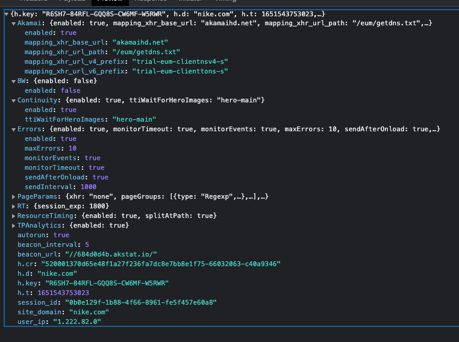

## 문제

---

- No operations to execute 에러 발생

## 원인 분석

---

- No operations to execute 에러는 몽고DB에 빈배열을 넣을때 발생함
    - 왜 빈배열인지 찾아봐야 됨.
- 최근 크롤링 함수를 수정했던 부분중 몽고DB에서 데이터를 가져 온 다음 다시 최신 정보를 업데이트 해주는 함수가 있음.
- 데이터를 가져 올때 기존 데이터가 존재 하지 않아서 발생함.

## 해결

---

- 기존 데이터가 없을시 새로운 데이터를 만들어서 진행할수 있도록 수정