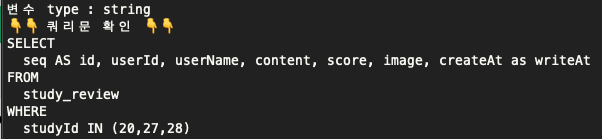
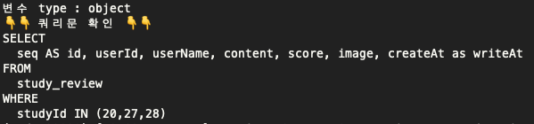

## INTRO

---

- 쿼리문을 작성할때 한번에 원하는 여러개의 Id값을 가지고 각각의 결과를 얻고 싶었다.
- 일반적으로 반복문을 통해 하나하나 불러 올수 있다.
- 반복문을 통해 결과값을 가져올 경우 반복문의 횟수 만큼 트랜젝션이 발생하여 향후 데이터가 많아졌을데 DB에 과한 부하가 걸릴것으로 예상된다.
- 이를 개선하기 위해 한번의 트랜젝션으로 모든 데이터를 얻어야 한다.
- 한번의 트랜젝션으로 원한는 데이터를 얻기 위해 WHERE ~ IN() 을 활용 한다.

## 문제점

---

- WHERE ~ IN()을 사용할때 IN() 안에 들어갈 ID값들에 대한 처리가 어려웠다.
    - IN()안에 들어가는 값들이 수가 매번 달라진다.

## 원인 분석

---

- 쿼리문을 작성할때  ‘?’ 를 사용하여 변수를 넣어 주었다.
- ‘?’를 사용하게 되면 쿼리문 안에서 여러가지 변수를 한 row에 순서에 맞게 나열만 하면 되기 때문에 팀내에서 ‘?’를 사용하는 것이 암묵적인 룰 이었다.
- 문제는 아래 코드와 같이 WHERE ~ IN ()을 사용할때 변수(studyList)의 형태를 정리하기 어려웠다.
    
    ```jsx
       let studyList = "1,13,16,20"
       conn = await readOnlyMysqlPool.getConnection();
        [rows] = await conn.execute(
          `SELECT
                seq AS id, userId, userName, content, score, image, createAt as writeAt
            FROM
                study_review
            WHERE
                studyId IN (?)`,
          [studyList],
        );
    ```
    
- 변수(studyList) 또한 다른 데이터 베이스에서 가지고 왔기 때문에 아래와 같이 표기되었다.
    
    ```jsx
       let studyList = "[1,13,16,20]"
    ```
    

## 해결

---

1. 변수 형태 정리
    
    ```jsx
      let studyList = "[1,13,16,20]"
    	studyList = studyList.slice(1, studyList.length - 1).split(',');
    
    // studyList = ['1','13','16','20']
    ```
    
2. ‘?’ 대신 `${}`를 사용
    - ‘?’를 사용하여 배열을 넣게 되면 에러가 발생 하였다.

[개선코드]

```jsx
    let studyList = ['1','13','16','20']
    conn = await readOnlyMysqlPool.getConnection();
    [rows] = await conn.execute(
      `SELECT
            seq AS id, userId, userName, content, score, image, createAt as writeAt
        FROM
            study_review
        WHERE
            studyId IN (${studyList})`,
    );
```

- 추가적으로 `${}`를 사용했을때 변수의 type이 string 이나 Object(배열)이나 상관이 없었다.
    - 변수의 형태를 변경하기 위해 join()함수를 사용했을때 아래와 같이 배열이 string으로 변환 되었다.
    - 이때 ‘?’를 사용하게 되면 제일 앞에 있는 숫자만 인식된다.

```jsx
   let studyList = "1,13,16,20"
```





```jsx
   let studyList = [1,13,16,20]
```

