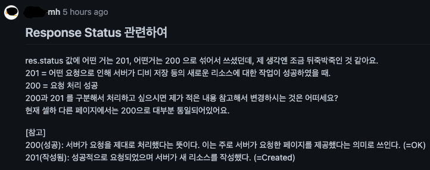

## 문제점

---

- **Response Status 값을 무지성으로 200과 201을 혼합하여 코드 작성**

## 원인 분석

---

- status 값 구분에 대한 인식 부족

## 해결

---

- Status 값 200, 201 구분하여 처리
    
    201 = 어떤 요청으로 인해 서버가 디비 저장 등의 새로운 리소스에 대한 작업이 성공하였을 때.
    
    200 = 요청 처리 성공
    
    ⇒ Read 요청을 200 처리, Creat, Update, Delete 요청 201 처리로 수정함

## 더 알아 보기

---

이렇게 해결 되었지만 사실

이정도면 따귀 안맞은게 다행이다. 그러니 더 알아보도록하자.

어짜피 기억하는거만 쓰겟지만 많이 사용될것 같은것만 추려보겠다.

자세한 코드는 [위키백과](https://ko.wikipedia.org/wiki/HTTP_%EC%83%81%ED%83%9C_%EC%BD%94%EB%93%9C)에 아주 잘 나와 있는듯 하다.

- 1xx (정보): 요청을 받았으며 프로세스를 계속한다
- 2xx (성공): 요청을 성공적으로 받았으며 인식했고 수용하였다
- 3xx (리다이렉션): 요청 완료를 위해 추가 작업 조치가 필요하다
- 4xx (클라이언트 오류): 요청의 문법이 잘못되었거나 요청을 처리할 수 없다
- 5xx (서버 오류): 서버가 명백히 유효한 요청에 대해 충족을 실패했다

### **2xx (성공)**

이 클래스의 상태 코드는 클라이언트가 요청한 동작을 수신하여 이해했고 승낙했으며 성공적으로 처리했음을 가리킨다.

- 200(성공): 서버가 요청을 제대로 처리했다는 뜻이다. 이는 주로 서버가 요청한 페이지를 제공했다는 의미로 쓰인다.
- 201(작성됨): 성공적으로 요청되었으며 서버가 새 리소스를 작성했다.
- 202(허용됨): 서버가 요청을 접수했지만 아직 처리하지 않았다.
- 203(신뢰할 수 없는 정보): 서버가 요청을 성공적으로 처리했지만 다른 소스에서 수신된 정보를 제공하고 있다.
- 204(콘텐츠 없음): 서버가 요청을 성공적으로 처리했지만 콘텐츠를 제공하지 않는다.
- 205(콘텐츠 재설정): 서버가 요청을 성공적으로 처리했지만 콘텐츠를 표시하지 않는다. 204 응답과 달리 이 응답은 요청자가 문서 보기를 재설정할 것을 요구한다(예: 새 입력을 위한 양식 비우기).
- 206(일부 콘텐츠): 서버가 GET 요청의 일부만 성공적으로 처리했다.

### **4xx (요청 오류)**

4xx 클래스의 상태 코드는 클라이언트에 오류가 있음을 나타낸다.

- 400(잘못된 요청): 서버가 요청의 구문을 인식하지 못했다.
- 401(권한 없음): 이 요청은 인증이 필요하다. 서버는 로그인이 필요한 페이지에 대해 이 요청을 제공할 수 있다. 상태 코드 이름이 권한 없음(Unauthorized)으로 되어 있지만 실제 뜻은 인증 안됨(Unauthenticated)에 더 가깝다.
- 402(결제 필요): 이 요청은 결제가 필요합니다.
- 403(Forbidden, 금지됨): 서버가 요청을 거부하고 있다. 예를 들자면, 사용자가 리소스에 대한 필요 권한을 갖고 있지 않다. (401은 인증 실패, 403은 인가 실패라고 볼 수 있음)
- 404(Not Found, 찾을 수 없음): 서버가 요청한 페이지(Resource)를 찾을 수 없다. 예를 들어 서버에 존재하지 않는 페이지에 대한 요청이 있을 경우 서버는 이 코드를 제공한다.
- 408(요청 시간초과): 서버의 요청 대기가 시간을 초과하였다.
- 409(충돌): 서버가 요청을 수행하는 중에 충돌이 발생했다. 서버는 응답할 때 충돌에 대한 정보를 포함해야 한다. 서버는 PUT 요청과 충돌하는 PUT 요청에 대한 응답으로 이 코드를 요청 간 차이점 목록과 함께 표시해야 한다.
- 416(처리할 수 없는 요청범위): 요청이 페이지에서 처리할 수 없는 범위에 해당되는 경우 서버는 이 상태 코드를 표시한다.
- 429(너무 많은 요청): 사용자가 일정 시간 동안 너무 많은 요청을 보냈다.

### **5xx (서버 오류)**

서버가 유효한 요청을 명백하게 수행하지 못했음을 나타낸다.

- 500(내부 서버 오류): 서버에 오류가 발생하여 요청을 수행할 수 없다.
- 501(구현되지 않음): 서버에 요청을 수행할 수 있는 기능이 없다. 예를 들어 서버가 요청 메소드를 인식하지 못할 때 이 코드를 표시한다.
- 502 (Bad Gateway, 불량 게이트웨이): 서버가 게이트웨이나 프록시 역할을 하고 있거나 또는 업스트림 서버에서 잘못된 응답을 받았다.
- 503(서비스를 사용할 수 없음): 서버가 오버로드되었거나 유지관리를 위해 다운되었기 때문에 현재 서버를 사용할 수 없다. 이는 대개 일시적인 상태이다.
- 504(게이트웨이 시간초과): 서버가 게이트웨이나 프록시 역할을 하고 있거나 또는 업스트림 서버에서 제때 요청을 받지 못했다.
- 505(HTTP 버전이 지원되지 않음): 서버가 요청에 사용된 HTTP 프로토콜 버전을 지원하지 않는다.
- 520(Unknown Error, 알 수 없음)
- 598(네트워크 읽기 시간초과 오류, 알 수 없음)
- 599(네트워크 연결 시간초과 오류, 알 수 없음)