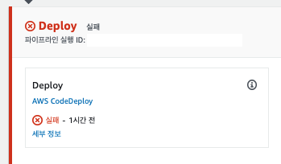
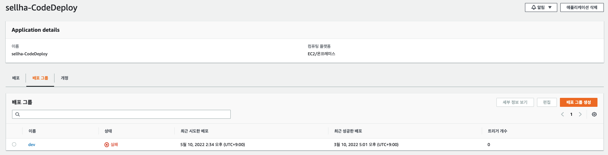
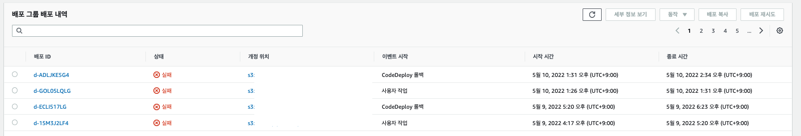
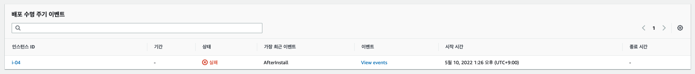
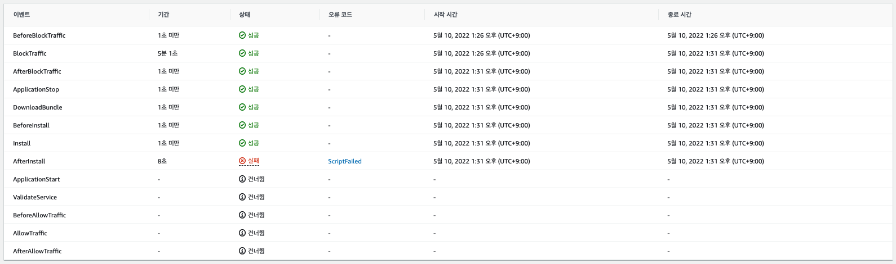
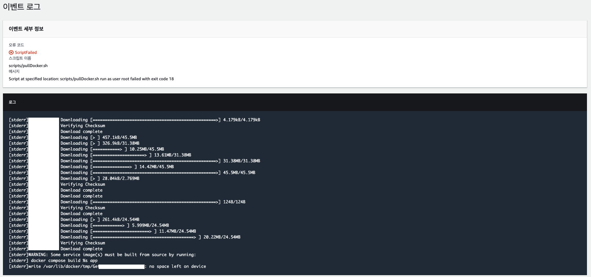
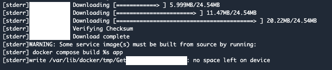
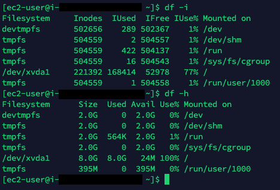

 

## Intro

---

Martin이 구축해 놓고 간 develop sever에  CICD가 문제가 생겼다.

사실 문제가 생긴지 한달정도 되었지만 급한 Task로 인해 사실상 develop server이기도 하고, 배포 그때 그때 수동 배포로 진행을 해왔는데, 더이상 내버려 둘수 없어 Error를 추적 했다.

 

## Error 추적

---

CICD를 구축하는 방법은 여러가지 이고, 현재 회사에서 구축되어 있는 CICD를 내가 설계한것이 아니기 때문에 어디서 부터 Error가 시작되는지 추적해 볼 필요가 있다.

code pipeline에 가보니 code deploy에서 에러가 난것을 볼수 있었다.

*~~그 앞 단계에서 에러나 났다면 좀더 복잡졌을거 같아서 우선은 다행이다...~~*

code deploy 안에서 보니 dev 그룹에 상태가 실패로 문제가 있는것이 보인다.

이름을 클릭해서 그룹안에 들어오면 그룹 배포 내역에 많은 에러가 발생한것으로 보인다.

그중 이벤트 시작에 사용자 작업한것을 확인해보자.

해당 배포ID를 클릭해 들어오니 배포 수명 주기 이벤트에 상태가 실패인것이 확인 가능하고, View event를 확인해 볼수 있다.

View event를 열어보면 이벤트들이 나열되어 있고, 이벤트중 AfterInstall에서 에러가 발생한것이 보인다. scriptFailed를 클릭해 보자.

이벤트 로그를 보면 오류 코드 확인인 가능하다.

`no space left on device` 라는 오류 메세지를 확인할수 있다.

 

## 원인 분석

---

`no space left on device` 를 보니 서버 인스턴스로 들어가 EC2 남은 용량 확인이 필요한것같다.

`dh -i` 로 inodes 값 확인했고, `df -h` 로 용량확인하였다.

인스턴스 확인 결과 `/dev/xvda1` 에 용량이 100%다.

아마도(정확하진 않지만) 배포를 할때 과거의 이미지가 쌓여 용량이 가득찬것으로 보인다.

 

## 해결방안

---

inodes나 용량 중 둘중 하나라도 100%가 있으면 no space left on device 에러가 발생한다.

나의 경우엔 용량이 꽉 찬거라서 아래 블로그의 방법으로 용량을 확보했다.

[[EC2][Server][Docker] EC2 용량 꽉 찼을 때 해결 / No space left on device 해결](https://velog.io/@ssssujini99/EC2ServerDocker-EC2-%EC%9A%A9%EB%9F%89-%EA%BD%89-%EC%B0%BC%EC%9D%84-%EB%95%8C-%ED%95%B4%EA%B2%B0%EB%B0%A9%EB%B2%95-No-space-left-on-device-%ED%95%B4%EA%B2%B0)

 

EC2 용량을 단순히 늘려주는것은 간단하게 끝났지만, 늘려준 용량을 또 xvda1에 적용을 해야 하기 때문에 약간 번거로움이 있다.

참고로 inodes문제는 아래 링크를 통해 해결할수 있다.

[No space left on device / 장치에 남은 공간이 없음 증상 해결](https://xinet.kr/?p=1452)

 

 

## Outro

---

- 해결 방안이 마음에 들지 않는다.
    - 앞으로도 계속해서 쌓이는 데이터들에 대해서는 어떻게 해야 할까?
    - 이전 이미지를 지우는 방법을 찾아서 해보았지만 많은 용량이 지워지지 않았다.
    - 구글링 결과 대부분 용량을 늘리는 해결법만 나와 있었다.
    - 만약 다시한번 용량이 찬다면 shell 안에 이전 이미지에 대한 삭제 코드를 추가 해 놓을 필요가 있을것 같다.
- AWS code pipeline에 대한 지식이 많이 부족하다.
    - AWS 아키텍쳐들에 대해 전반적으로 공부해야 한다.