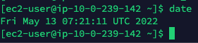
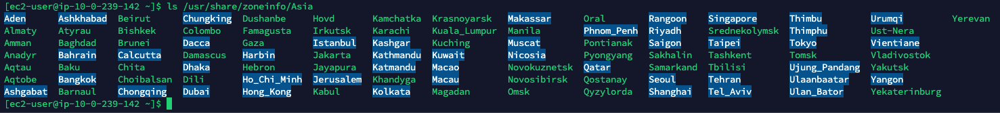
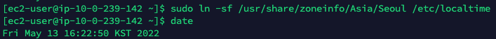

## 문제점

---

- 함수 실행을 예약해야 하는 코드가 있다.(이하 스케쥴러)
- 로컬에서 테스트를 할때는 스케쥴러가 잘 되었다.
- EC2 인스턴스에서 실행시 스케쥴러 되지 않았다.

## 원인 분석

---

- 리눅스의 시간이 한국 시간과 다르게 되어 있다.
- 한국 시간에 맞게 스케쥴러가 실행되어야 하는데 실행되지 않기 때문이다.
    
    이때는 쉽게 설정을 바꿔주면 된다.
    

## 해결

---

[EC2 인스턴스 시간 설정 바꾸기]

- 현재 시간을 확인 : 터미널에 `date` 입력.
    
   

입력해 보면 UTC 시간인것을 확인 할수 있다.

- ‘Seoul’ 파일 확인하기 : `ls/usr/share/zoneinfo/Asia`
    
    
    
- Localtime 심볼릭 링크 재설정 : `sudo ln -sf /usr/share/zoneinfo/Asia/Seoul /etc/localtime`
- 변경된 시간 확인 :  `date`
    
    