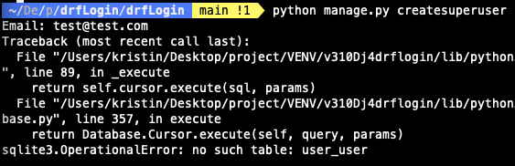
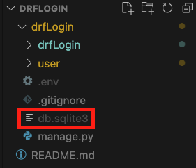

## 문제점

---

- 깃풀을 새로 해서 세팅하는데 마이그레이션을 해도 테이블이 계속 없다고 한다.
    
    
    
- 마이그레이션 초기화(삭제후 재생성)을 했는데도 동일하게 테이블이 없다고 한다.
    - `django.db.utils.OperationalError: no such table: user_user`

## 해결

---

1. 기존 db 삭제 ⇒ db.sqlite3 제거
    
    
    
2. migration 생성
    1. migration 생성
        
        `python manage.py makemigrations`
        
    2. 테이블 생성
        
        `python manage.py migrate --run-syncdb`
        
3. 계정 생성

    

## 결론
---

식겁했다..
